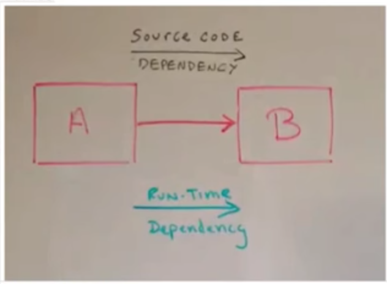
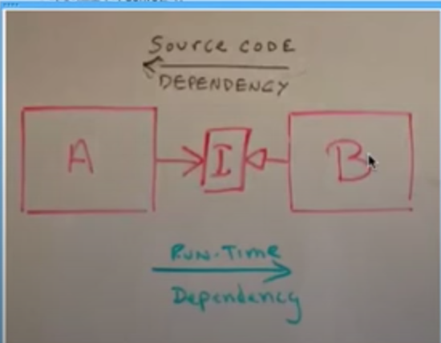
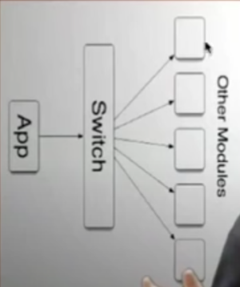
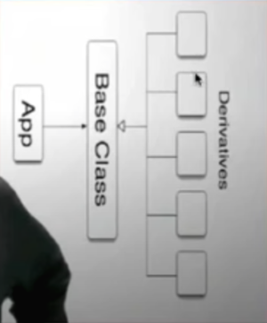
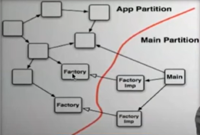

> 백명석 님의 [클린 코더스 강의](https://www.youtube.com/user/codetemplate/videos)를 듣고 요약정리한 글입니다. 문제가 있을 경우 삭제 조치하도록 하겠습니다.

## 1. Arguments

### 인자는 최대 3개, 그리고 Introduce Parameter Object

당연히 인자가 많아지면 복잡도가 증가한다. 최대 3개의 인자만 사용해라. 일단 기본적으로 외우기 어렵고, Introduce Parameter Object라는 기법을 이용하라. 

```java
public class Customer {
    amountInvoicedIn(Date start, Date end) {...}
    amountReceivedIn(Date start, Date end) {...}
}
```

위와 같은 상황을 아래와 같이 개선 가능하다.

```java
public class Customer {
    amountInvoicedIn(DateRange dateRange) {...}
    amountReceivedIn(DateRange dateRange) {...}
}
```

### 생성자의 인자가 많은 경우, Builder 패턴 사용

만약 생성자에 많은 수의 인자를 넘겨야 한다면 어떻게 해야 하는가? 예를 들면 아래 상황과 같다.

```java
public class NutritionFacts {
    private final int servingSize;
    private final int servings;
    private final int calories;
    private final int fat;
    private final int sodium;
    private final int carbohydrate;
    
    public NutritionFacts(int servingSize, int servings, int ca...){...}

}
```

위와 같은 클래스를 생성할 때, 아래와 같이 알아보기 어렵다.

```java
public class NutritionFactsTest {
    @Test
    public void canCreate(){
        NutritionFacts cocaCola = new NutritionFacts(240, 8, 100, 0, 35, 27);
    }
}
```

이러한 문제는 첫 번째로, **자바 빈 패턴(getter, setter을 둠)**을 사용할 수 있다. 하지만 이러한 방법은 set이 완료되기 전에는 불완전한 상태를 가지게 되는 문제가 생긴다. 이것보다 나은 방법은 **Builder 패턴**을 적용하는 것이다.

```java
public class NutritionFacts {
    private final int servingSize;
    private final int servings;
    private final int calories;
    private final int fat;
    private final int sodium;
    private final int carbohydrate;
    
    public static class Builder {
        //required parameters
        private final int servingSize;
        private final int servings;
        
        //Optional parameters
        private int calories = 0;
        private int fat = 0;
        private int carbohydrate = 0;
        private int sodium = 0;
        
        public Builder(int servingSize, int servings) {
            this.servingSize = servingSize;
            this.servings = servings;
        }        
    	
        public Builder calories(int val) {
            claories = val;
            return this;
        }
        
        ...
        
        public NutritionFacts build() {
            return new NutritionFacts(this);
        }
        
    }
    
    private NutritionFacts(Builder builder) {
        servingsSize = builder.servingSize;
        servings = builder.servings;
        ...
        
    }
}
```

아래와 같이 훨씬 읽기 쉽다.

```java
public class NutitionFactsTest {
    @Test
    public void canCreate() {
        NutritionFacts cocaCola = 
                new NutritionFacts.Builder(240, 8)
                        .calories(100)
                        .sodium(35)
                        .carbohydrate(27)
                        .build();
    }
}
```

### Boolean 인자 금지

그리고, Boolean을 인자로 사용하지 말아야 한다. Boolean을 인자로 사용하는 메서드는 2가지 이상의 일을 하는 것이다. (true, false 각 경우) 즉, 2개의 함수로 분리할 수 있다. 두 개의 함수의 공통적인 부분은 또 다른 함수로 추출할 수 있다. 이름을 잘 지은 경우, 바디를 안 봐도 되는 이점이 있다.

### Innies not Outies

output 인자를 사용하지 말아야 한다. 즉, 인자는 함수로 전달되는 것이지, 함수로부터 변경되어 나오는 것이 아니다. output 인자 대신 함수 내부의 로컬 변수를 이용해서, 반환을 하는 것이 좋다.

> 왜 좋을까에 대한 나의 생각 -  returnText라는 output 인자를 반환하는 대신 로컬 변수를 반환하면, 기존 output 인자에 대한 사이드 이펙트를 막을 수 있지 않을까라는 추측을 해봤다. 또한, 내 생각에는 아래의 경우에는 output 인자 자체의 함수로 만드는 것이 더욱 응집도 높은 설계가 아닐까 싶었다. ex) returnText.toSimpletext(table)을 호출

 아래와 같은 경우를 금지한다.

```java
private String toSimpleText(Parse table, StringBuffer returnText){
    if(table.parts == null){
        simpletextOfLeave(table, returnText);
        simpleTextOfMore(table, returnText);
        return returnText.toString();
    }
    simpleTextOfParts(table, returnText);
    simpleTextOfMore(table, returnText);
    return returnText.toString();
}
```

### the null defense

null을 전달/기대하는 함수는 없어야한다. Boolean을 전달하는 만큼 잘못된 것이다. 만약 이러한 경우에는 null인 경우의 행위와 null이 아닌 경우의 행위, 즉 2개의 함수로 만드는 것이 맞다. 달리 말하자면, null을 Boolean처럼 사용하면 안 된다.

또한 defensive 프로그래밍을 지양해야 한다. (null 체크는) 코드를 null과 에러 체크로 더럽히는 행위이고, 코드가 무언가 잘못되었다는 단서이다. (팀원이나 단위 테스트를 못 믿는 상황). 따라서, null 여부를 지속적으로 조사할 것이 아니라 단위 테스트에서 검증해야 한다. 하지만, public api의 경우에는 defensive 하게 프로그래밍해야 한다.

## 2. The Stepdown Rule

stepdown rule은 모든 public은 위에, 모든 private은 아래에 두는 것을 의미한다. public part만 사용자들에게 전달하면 되기 때문이다. 따라서 중요한 부분은 위로 보내고, 상세한 부분은 밑으로 보내야 한다. 이러한 방법에는 두 가지 이점이 있다.

-   편집자들은 마지막 부분은 필수적인 내용 전달 오류 없이 제거할 수 있다. (코드 작성자가 의도 전달 시, 중요한 것만 보여 줄 수 있음)
-   독자(코드 리더)들은 제일 위에서부터 읽기 시작해서 지루해지면 그만 읽으면 된다.


<figure>


<figcaption>출처 : 백명석님의 클린 코더스</figcaption>
</figure>

또한 backward reference 없이 top에서 bottom으로 읽을 수 있도록 작성해야 한다. 이해를 위해서 아래 코드를 보자.

```java
public void serve(Socket s) {
  try {
      tryProcessInstructions(s);
  } catch(Throwable e) {
  } finally {
      slimFactory.stop();
      close();
      closeEnclosingServiceInSeperateThread();
  }
}

private void tryProcessInstructions(Socket s) throws Exception {
    initialize(s);
    ...
}

private initialize(Socket s) thorws Exception {...}
```

serve 메서드 밑에 바로 tryProcessInstructions 메서드가 있어야 한다. 즉, tryProcessInstructions를 찾기 위해서 serve 이전 코드를 확인하면 안 된다. 만약 이를 지키지 않는다면, 위에서 아래로 코드를 읽는 흐름이 깨지게 된다.

## 3. Switch and cases

객체지향의 가장 큰 이점 중 하나는 의존성을 관리하는 능력이다. 의존성 관리를 통해서, 상위 로직이 하위 로직에 의존하는 경우로부터 보호할 수 있다. 만약 이를 지키지 않는다면, 독립적으로 모듈을 배포하거나, 컴파일하거나, 개발이 불가능하다. 예를 들자면, A 모듈(상위 로직)이 B 모듈(하위 로직)을 의존하게 된다면, 독립적으로 배포/컴파일/개발이 불가능하다. 이를 **소스 코드 의존성**과 **런타임 의존성** 두 개가 생긴다고 볼 수 있다.

<figure>


<figcaption>리팩토링 이전(왼쪽)과 DIP 적용(오른쪽)</figcaption>
</figure>

하지만, 객체지향은 런타임 의존성은 그대로 둔 채로 소스 코드 의존성을 역전시킬 수 있다. 이를 DIP라고 한다. 예를 들자면, 본래의 의존성을 제거하고, 다형성 인터페이스를 삽입한다. 이후 모듈 A는 인터페이스에 의존하고, 모듈 B는 인터페이스로부터 derive 한다. 즉, 모듈 B의 소스 코드 의존성은 런타임 의존성의 반대가 될 수 있다. 하지만 A는 여전히 B의 기능을 이용하기 때문에 런타임 의존성은 그대로이다. (독립적인 배포가 가능하다.)

> 스프링을 사용하면 좋은 점은, 비단 편리해서가 아니라 스프링이 권장하는 스타일을 준수하면 DIP를 만족 가능하기 때문이다. (객체지향적으로 개발 가능)

하지만, 스위치 문장은 **독립적 배포에 방해**가 된다. 왜냐하면 각 케이스마다 다른 모듈을 콜 할 수 있기 때문이다. (여러 소스코드 의존성이 생김) 또한 스위치 문을 사용하는 또 다른 코드들이 존재할 수 있다.

즉, 스위치문의 단점을 아래와 같이 정리 가능하다.

-   각 case 문장은 외부 모듈에 의존성을 갖는다.
-   다수의 다른 모듈이 스위치문에 대한 의존성을 가질 수 있다.
-   이를 fan-out problem이라고 한다. (외부에 여러 군데로 의존성을 가지는 문제)

### 그렇다면, 어떻게 switch 문을 제거할 수 있을까?

1.  switch 문장을 다형성 인터페이스 호출로 변환한다. (다형성 인터페이스 이용)
2.  case에 있는 문장들을 별도의 클래스로 추출하여 변경 영향이 발생하지 않도록 한다.

<figure>


<figcaption>리팩토링 이전(왼쪽)가 리팩토링 이후(오른쪽)</figcaption>
</figure>

위와 같이 리팩토링하게 되면, 런타임 의존성은 그대로이지만, 소스 코드 의존성이 역전된다. 이렇게 되면, 개발자가 신경 써야 할 일은 언제/어떻게 인스턴스들을 생성하는 것이다. 그리고 이런 일들은 보통 팩토리에서 수행한다. 실제 impl을 전달하는 main이 존재하는 구간을 **Main Partition(하위 레벨 구간, 스프링과 같음)**이라고 한다. 그리고 인터페이스를 사용하는 구간을 **Application Partition(상위 레벨 구간, 애플리케이션 코드)**이라고 한다. 항상 모듈 다이어그램은 아래처럼 선을 그을 수 있어야 한다. 런타임 의존성은 App에서 Main으로 가지만, 소스 코드 의존성은 항상 역전되어야 한다. 이러한 기법을 **dependency Injection**이라고 한다.

<figure>

<figcaption>출처: 백명석님의 클린 코더스</figcaption>
</figure>

> 더욱 깊은 내용은 클린 코드 책의 Funciton - Switch를 참고하면 좋다.