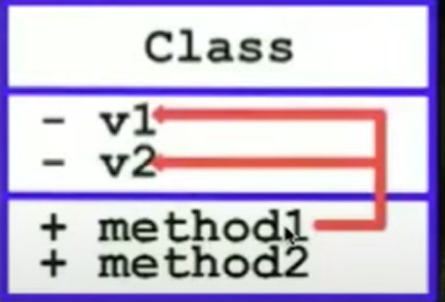
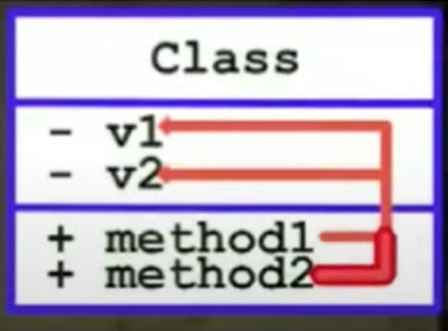
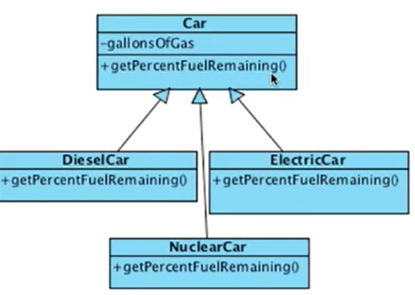
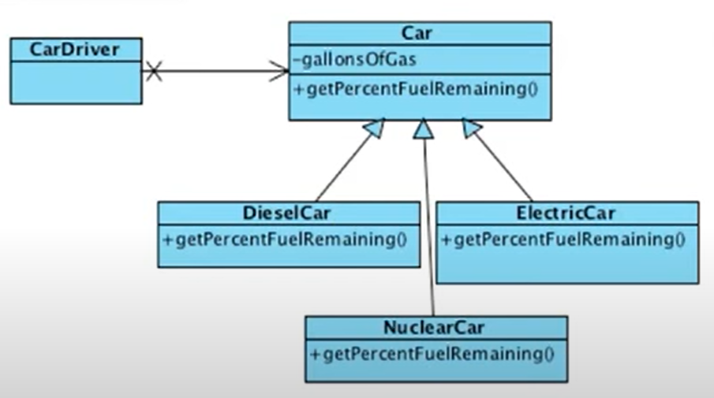
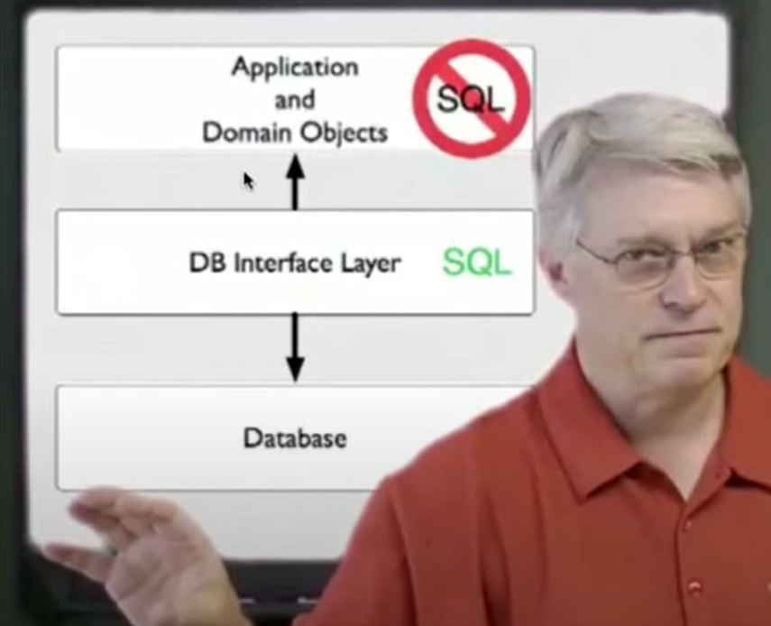
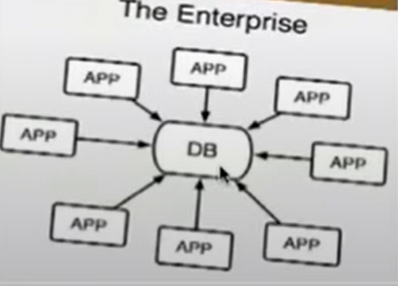
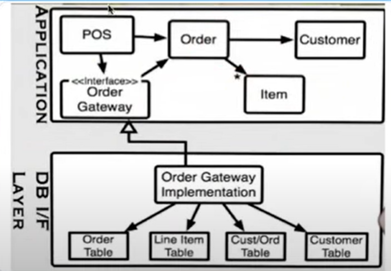
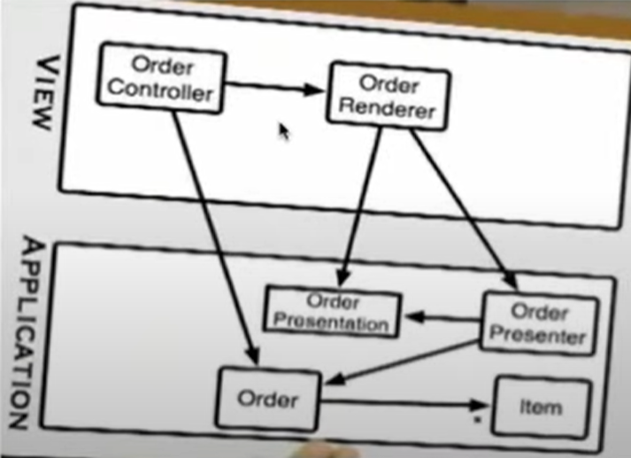

> 백명석 님의 [클린 코더스 강의](https://www.youtube.com/user/codetemplate/videos)를 듣고 요약정리한 글입니다. 문제가 있을 경우 삭제 조치하도록 하겠습니다.

## 1. Coding Standards

조직이 일정 수준의 크기가 되면 관료적인 문서화를 요구한다. 문서화 자체는 필요하다. 하지만, 별도의 문서는? 음... 글쎄다. Coding Standards는 코드 내에서 명확하게 보여야 한다. 즉, 코드 자체가 Coding Standards가 되어야 한다.

## 2. Comments should be Rare

프로그래머는 관료적으로 주석을 작성한다.  (실용적이지 못하고, 해야해서 하는 일) 이러한 주석은 의미 없고, 사람들은 대부분 무시한다. (무시의 대상)

```java
/**
 * Sets a configuration property;
 *
 * @param key    the property key
 * @param value  the property value
 */
 public void setConfigProperty(final String key, final String value) {
 ...
 }
```

주석은 특별한 경우나 개발자의 의도를 위해 반드시 필요할 때만 작성해야한다. 프로그래머의 의도는 변수나 함수, 클래스의 이름으로 잘 드러나야 하는데, 그럴 수 없을 때만 주석을 작성해야 한다. (주석을 읽는 모든 사람들이 감사해야 함)

## 3. Comments are Failures

작성자의 의도가 잘 나타나게 프로그램을 작성한다면, 주석은 불필요하다. 하지만, Assembly의 경우에는 불가능하다. (주석이 필수적) 반면  Ruby, Java, C# 등은 표현력이 뛰어나다. 주석을 작성한다는 것은 코드가 표현적이지 못하다는 것을 나타내는 **실패의 상징**이다.

## 4. Good Comments

좋은 주석의 종류는 아래와 같다.

-   라이선스 표시와 같은 **Legal Comments**
-   정규식과 같은 상황에서 정보성이 있는 **Informative Comments**
-   엄청 큰 파일을 읽어와야 하는 테스트의 경우 작성할 수 있는 **Warning of Consequences**
-   나중에 할 일을 작성할 **TODO Comments**
-   아무리 이름을 잘 적어놔도 사용하는 사람들을 믿지 못했을 경우, **Public Api Documentation** 

## 5. Bad Comments

나쁜 주석의 종류는 아래와 같다.

-   여차저차의 반복. 중얼거리는 느낌의 **Mumbling**
-   이미 이름으로 알 수 있는데 중복적인 설명, **Redundant Explanations**
-   그냥 의무적으로 반복 작성하는 **Mandated Redundancy**
-   누가 언제 만들었고, 언제 수정했는지를 설명하는 **Jounal Comments**
-   절대 만들면 안 되는 주석, 누가 기본 생성자인 거 몰라? **Noways Comments**
-   잘 보이라고 별표로 강조해놓고... 굳이? 차라리 커밋을 이쁘게 쓰자 **Big Banner Comments**
-   이것은 if의 끝이야.. for의 끝이야..  **Close Brace Comments**
-   add by le2sky, 이런거.. 중요하지 않음 **Attribution Comments**
-   html로 이쁘게 작성하는 **HTML in Comments**
-   멀리 떨어진 곳의 코드를 설명하는 주석은 주석과 무관하게 변경될 수 있다**. Non-Local Information**

## 6. Vertical Formatting

공란을 함부로 사용하면 안 된다. 공란을 아래의 경우에 사용하자.

-   메서드 사이
-   private 변수들과 public 변수들 사이
-   메서드 내부에서, 변수 선언과 메서드 실행의 나머지 부분 사이
-   메서드 내부에서, if/while 블록과 다른 코드 사이

그리고, 서로 관련된 것들을 vertical 하게 근접해야 한다. vertical 한 거리가 그들 간의 관련성을 나타낸다. 그렇지 않으면 나중에 로직을 분리하기 힘들다. (리팩터링 하기 어려움)

눈에 이쁘게 보이게 하려는 것이 아닌, 관련된 정보를 나누기 위함이다.

## 7. Classes

### 클래스란 무엇인가?

private 변수들을 작성함으로써 클래스를 작성한다. 그리고 그 private 변수들을 public 함수들로 조작한다. (외부에서는 private 변수들이 없는 것처럼 보인다.)

### 객체의 상태를 외부에서 사용할 수 있도록 하는 getter/setter/property 등을 제공하는 것은 Bad Design

변수를 private으로 선언하고, getter/setter를 제공하면 내부에 뭐가 있는지 짐작이 가능하다. (캡슐화를 저해)

### Tell, Don't Ask

객체가 관찰할 수 없는 상태를 갖는다면, 무엇을 하라고 시키기(tell) 쉽고, ask 할 가치가 없어진다. 그리고 이 규칙을 따르는 객체는 getter가 많지 않다. 그리고 getter가 많지 않으므로 setter도 많지 않다.

### Max cohesive와 Max cohesive class

아래의 method1은 응집도가 높다. 왜냐하면,  v1, v2를 모두 사용하기 때문이다. 

<figure>

<figcaption>출처 : 백명석님의 클린 코더스</figcaption>
</figure>

아래의 경우는 응집도가 높은 클래스이다. 왜냐하면, 모든 메서드가 둘 다 v1, v2를 사용하기 때문이다. 

<figure>

<figcaption>출처 : 백명석님의 클린 코더스</figcaption>
</figure>

### getter/setter는 응집도가 낮다.

왜냐하면, 하나의 변수만 사용하기 때문이다. 클래스가 getter/setter를 많이 가질수록 응집도가 낮아진다. 하지만, getter/setter를 없앨 수는 없다. 대신 최소화하자.

### getter를 추상화하여 제공

getter를 사용할 때, getName 이런 거 하지 말고, 추상화를 통해서 제공해야 한다. 예를 들어, gallonsOfGas라는 변수가 있을 때, getGallonsOfGas라는 이름은 구현 내용을 너무 드러낸다. 즉, 이 메서드의 사용자들은 클래스에 gallonsOfGas라는 변수가 있다는 것을 추론할 수 있다.

만약 gallonsOfGas를 가지고 있는 Car를 DieselCar가 상속받았다고 가정했을 때, DieselCar는 가솔린은 사용하지 않는다는 문제가 생긴다.

따라서 만약, getter를 외부에 노출해야 하는 상황이라도, 아래처럼 추상화를 사용하자.

<figure>

<figcaption>출처 : 백명석님의 클린 코더스</figcaption>
</figure>

### 다형성이 생각나는가?

자동차가 어떤 종류인지는 상관없지만, getPercentFuelRemaining을 호출하면, 알아서 할 것이다. 내부 변수를 감췄을 때, 다형성의 이점을 얻을 수 있다. (상세 구현을 덜 노출할수록 다형성 클래스를 활용할 기회가 늘어난다.)

### 다형성은 독립적인 배포 가능성과 플러그인 구조의 핵심이다.

<figure>

<figcaption>출처 : 백명석님의 클린 코더스</figcaption>
</figure>

독립적인 배포가 가능하다는 이야기는 독립적인 컴파일이 가능하다는 이야기이고, 독립적인 컴파일 가능하단 이야기는 독립적인 개발이 가능하다는 이야기이다. CarDriver를 개발하는 사람은 누가 Car의 구현체를 개발하는 동안 기다리지 않고, 종속적인 인터페이스만을 보면서 개발한다. 

즉, 다형성은 클라이언트 코드를 서버 코드의 구현 변경으로부터 보호한다. 이것이 객체지향의 핵심이다. IoC를 통해 High Level 정책(클라이언트, 비즈니스 로직)을 Low Level Detail로부터 보호하는 것이다.

## 8. Data Structure

class와 반대되는 개념이다. 메서드가 존재하지 않고, public variables만 존재한다. 반면, 클래스는 private variables가 있으며, public 메서드들이 존재한다.

| **class** | **data structure** |
| --- | --- |
| private 변수들 + 이를 다루는 함수들 | public 변수들 + getter/setter |
| cohesive groups of variables를 조작하는 메서드 | 개별 변수들을 조작(getter/setter) |
| 구현을 감추고, 추상화 | 구현을 노출 |
| Tell 이 가능 | Tell은 불가, Ask만 가능 |

다형성을 이용하는 클래스에게 generic 한 일을 수행하라고 tell할 수 있다. 그러면 자동으로 타입에 맞는 적절한 행위가 발생한다. (polymorphically dispatch to appropriate method)

반면, data structure은 generic한 행위를 수행하라고 tell 할 수 없다. (type 기반으로 메서드 호출을 해야 함, 아마 switch 문을 사용해야 함) => 다형성 쓸 수 있을 거 같은데?

```java
public class Employee {
    public enum Type {HOURLY, SALARIED}
    
    public Type type;
    public String firstName;
    public String lastName;
    public Calendar dob;
    public String ssn;
}

class Utilities {
    void print(Employee e) {
        switch (e.type) {
            case HOURLY:
                printHourlyEmployee(e);
                break;
            case SALARIED:
                printSalariedEmployee(e);
                break;
        }
    }
}
```

객체지향은 새로운 기능을 추가하는데 취약하지만 타입 추가에는 강하다. (visitor 패턴으로 해결 가능) 반면, DS는 타입 추가에는 약하고, 기능 추가에는 강하다.

## 9. Boundaries

<figure>

<figcaption>출처 : 백명석님의 클린 코더스</figcaption>
</figure>


main이 app 파티션의 플러그인이다. main과 app 파티션을 나누는 것은 boundary의 예시다. 중요한 것은, boundary에서 한쪽은 concrete(main)하고, 다른 한쪽은 abstract(app)하다. boundary 사용 시 항상 concrete에서 abstract로 소스 코드 의존성이 있어야 한다.

예시로 DB(concrete)와 도메인 오브젝트(abstract)의 소스 코드 의존성 방향이 있다.

<figure>

<figcaption>출처 : 백명석님의 클린 코더스</figcaption>
</figure>

위 화살표는 소스 코드 의존성이다. 데이터베이스 인터페이스 레이어에서 애플리케이션, 도메인 오브젝트로 흐르는 의존성이 납득이 가지 않는다. (이론상 concrete에서 abstract이니깐 맞긴 해..)

객체지향 설계에서는 런타임 의존성을 변경하지 않고, 소스 코드 의존성을 역전시킨다. DIP를 이용하면, 애플리케이션이 데이터베이스 인터페이스 레이어의 존재를 모르고도 호출할 수 있다는 것을 의미한다.

> Application and Domain Objects에 DB Interface Layer에 대한 Inteface(Repository나 DAO 등)에 대한 참조를 갖는다는 말입니다. 구현체가 뭐가 될지는 main 역할을 하는 곳에서 주입해 주겠죠. 보통 spring framework이겠고요. DB Interface Layer는 Application and Domain Objects에 존재하는 DB Interface Layer에 대한 Interface를 implements 합니다. 그래서 소스 코드의 의존성이 역전된 거고요.  
>   
> 5년 전 백명석 님의 첨언

## 10. The Impedance Mismatch

OOP에서 RDB를 사용할 때 발생하는 일련의 개념적/기술적으로 어렵다. 특히 객체나 클래스의 정의가 데이터베이스 테이블이나 관계 스키마에 직접 매핑될 때 발생한다.

### DB Table은 DS이다.

데이터를 노출하고 메서드가 없다. (class와 반대) 그리고 DB 테이블은 너무나 concrete 해서 다형적일 수 없다. 그리고 도메인 객체, 비즈니스 객체, 어떤 객체도 포함할 수 없다. 오직, DS만 포함한다. (강제로 DS를 객체화할 수 없다.)

### ORM

hibernate도 진정한 orm이 아니다. 왜냐하면 DB row와 객체 간의 직접적인 매핑이 없기 때문이다. (하나는 DS, 하나는 객체라서..) 실제로 이런 툴은 RDB 테이블 -> DS로의 매퍼이다. hiberbate는 DB의 DS를 메모리의 DS로 매핑한다. (메서드는 안 만들어주니깐)

### Application/Domain Objects의 메서드들이 비즈니스 규칙이다.

일련의 비즈니스 규칙들을 도메인 객체에 구현하여 클래스를 만든다. 이 클래스들은 DB의 구조나 스키마와는 다른 모습을 가진다. (이것이 RDB와 OOD 간의 진정한 임피던스 불일치) 대개의 DB는 특정 Application을 위해서가 아니라 Enterprise를 위해서 최적화된다. 

<figure>

<figcaption>출처 : 백명석님의 클린 코더스</figcaption>
</figure>

DB 스키마는 enterprise의 보안, 성능을 위해 설계된다. 반면, 개별 app은 다른 스키마 디자인을 원할 것이다. 하지만 enterprise 전체의 combined needs에 순응해야 한다.

### application boundary 측면에서는 enterprise 스키마를 객체 설계를 통해 분리할 수 있다.

메서드를 노출하고 데이터를 감추는 것이 진짜 객체이다. 이렇게 해야지 테이블 row를 조작하는 대신 비즈니스 객체를 조작함으로써 애플리케이션을 보다 자연스럽게 하고 이해하기 쉽게 할 수 있다. 

<figure>

<figcaption>출처 : 백명석님의 클린 코더스</figcaption>
</figure>

데이터베이스 인터페이스 레이어는 DB에 존재하는 DS를 애플리케이션이 사용하고자 하는 비즈니스 객체로 전환하는 책임을 갖는다. 나아가 애플리케이션은 데이터베이스 인터페이스 레이어의 존재조차도 모르게 한다. 왜냐하면, 모든 소스 코드 의존성은 DB에서 애플리케이션으로 행해야 하기 때문이다. (concrete에서 abstract) 

이 말은 애플리케이션 계층에 데이터 액세스를 제공하는 인터페이스를 갖게 된다는 것을 의미한다. 비즈니스 객체가 이 인터페이스를 이용해서 자신이 원하는 데이터에 접근한다.

### View와 Application의 관계도 마찬가지다.

view가 concrete 이므로 application에 의존성을 가져야 한다.

<figure>

<figcaption>출처 : 백명석님의 클린 코더스</figcaption>
</figure>
