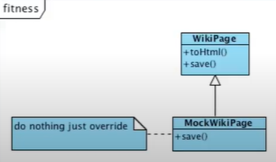

> 백명석 님의 [클린 코더스 강의](https://www.youtube.com/user/codetemplate/videos)를 듣고 요약정리한 글입니다. 문제가 있을 경우 삭제 조치하도록 하겠습니다.

## 1. What is Architecture

전체적인 시스템 개발에 기반을 제공하는 변경 불가한 초기 결정사항의 집합을 **아키텍처**라고 한다. 자바, 이클립스, 스프링, 톰캣, 하이버네이트 등등은 아키텍처가 아니다. 예를 들어, 건축의 아키텍처가 해머, 못 등이 아니듯 아키텍처는 도구나 Building material 등이 아니라 **사용법(Usage)**에 대한 것이다.

## 2. What is Use Case

시스템에서 사용법을 보여주는 것은 Use Case이다. 목표를 달성하기 위해 일반적으로 역할(actor)과 시스템 간의 상호작용을 정의하는 일련의 단계(절차)를 Use Case라 한다.

예를 들어, 게시글 작성하기의 경우 아래와 같다.

| 사용자 | 시스템 |
| --- | --- |
| 제목을 입력한다. |   |
|   | 제목의 유효성을 조사한다. |
| 본문을 입력한다. |   |
|   | 본문의 유효성을 조사한다. |
| 글 작성하기를 요청한다. |   |
|   | 글을 저장한다 |

## 3. Architecture Exposes Usage

아키텍처는 구체적인 상세한 내용들(기술 스택)이 아니라 사용법에 대해서 설명해야 한다. 어떤 기술을 쓰느냐가 중요한 게 아니라, 어떤 게 있는지 보여주는 것이 차라리 낫다. 아래에 Use case로 어떤 기능을 시스템이 제공한다는 것을 보여주면 더 좋을 것이다. (그래서 시스템이 뭘 하는데?)

<figure>

<figcaption>출처 : 백명석님의 클린 코더스</figcaption>
</figure>

MVC 구조만 있는 웹시스템은 보통 Use case를 숨기고 전달 메커니즘만 노출한다.(사용자-시스템-사용자 과정 설명) 하지만, 중요한 것은 전달 메커니즘이 아니라 Use case이다. Use case는 전달 메커니즘과 분리되어야 한다. 즉, UI, DB, F/W, Tools 등에 대한 결정들과 Use case는 완전히 분리시켜야 한다. **(Use case should stand alone)**

## 4. Deferring Decisions

좋은 아키텍처는 FW, WAS, UI 등과 같은 **stuff**들에 대한 결정을 연기하는 것을 허용한다. stuff에 대한 결정은 연기될 수 있어야 하고, 연기되어야 한다. 이것이 좋은 아키텍처의 주요한 목적 중 하나이다. 시간이 지날수록 결정을 위한 정보가 풍부해진다. 불확실한 상황에서 성급한 결정을 하지 말자.

## 5. Deferring Decisions의 예시 - Fitness

우리는 무언가를 하기 전에 DB를 먼저 기동하고 스키마를 개발해야 한다고 생각한다. 하지만, 사실 이게 바로 필요하진 않다.  따라서 Fitness는 처음에 MySQL을 연결할까 하다가, 위키 텍스트를 html로 변환하는 것에 초점을 맞췄다. (파싱, 번역하는 코드는 DB 없이도 개발 가능)

Fitness는 WikiPage라는 중요한 추상화를 발견했다. 그리고 일단 DB가 없어서 MockWikiPage를 만들었다. 

<figure>

<figcaption>출처 : 백명석님의 클린 코더스</figcaption>
</figure>

하나 이상의 페이지를 사용해야 하는 경우가 발생했을 때는 DB가 실제로 필요했다. 이때 Fitness는 InMemoryPage Test Double을 만들었다. (저장만 하면 되니깐)

<figure>

<figcaption>출처 : 백명석님의 클린 코더스</figcaption>
</figure>

결국에는 persistenct 없이는 구현할 것이 없어졌다. 생각해 낼 수 있는 새로운 테스트들은 항상 DB가 필요하고, DB를 기동 하고, 스키마를 만들고, DB에 위키 페이지를 저장하고 읽는 기능을 구현해야 한다. 이때 Fiteness는 FileSystemPage Test Double을 만들었다.

<figure>

<figcaption>출처 : 백명석님의 클린 코더스</figcaption>
</figure>

다 만들었는데 DB가 없어도 불편하지 않다. 기능적으로는 더 이상 뭘 할 필요도 없다. 그리고 Flat file system이 충분히 좋았기 때문에 MySQL은 사용하지 않았다. 우리가 여기서 주목해야 할 부분은 주요한 아키텍처 결정을 연기했다는 것이다. (DB 쓸까 말까? MySQL 쓸까 말까?) 최종적으로는 고객사에서 모든 데이터는 실제 DB에 넣어야 한다는 정책이 있어서 그렇게 했다. 이때는 MSqlPage를 추가했다.

## 6. Central Abstraction

많은 아키텍트는 DB를 core abstraction이라고 생각한다. 따라서 DB가 동작하고 스키마가 준비되기 전에는 어떠한 생각도, 작업도 시작하지 않는다. 데이터부터 생각하면, 절차지향적으로 접근하게 된다.

<figure>

<figcaption>출처 : 백명석님의 클린 코더스</figcaption>
</figure>

Fitness 프로젝트의 Central Abstraction은 WikiPage였다. 그리고 다음과 같은 좋은 아키텍처의 특징을 알려준다.

-   DB를 연기할 수 있는 Detail로 간주한다.
-   좋은 아키텍처는 Tool, FW(프레임워크)로 구성되는 것이 아니다.
-   좋은 아키텍처는 UI, WAS, DI FW 등과 같은 Detail에 대한 결정을 연기할 수 있도록 해준다.

연기를 하려면, 연기하고 싶은 것에서 구조를 분리하고, 무관하게 설계해야 한다. 그리고 분리하기 위해서는 아키텍처 측면에서 SW 환경이 아닌 Use Case에 집중해야 한다.

## 7. 결론

-   아키텍처를 Use case에 집중
    -   UI, 프레임워크, WAS, DB 등과 같은 다른 시스템 컴포넌트에 대한 결정을 미룰 수 있다.
    -   이러한 연기는 우리의 선택을 최대한 오래 열어 둘 수 있다.
    -   이 말은 필요에 따라 결정을 변경할 수 있다는 것이다.
    -   프로젝트 진행 중에 충분한 정보가 생김에 따라 undo에 대한 비용 없이 여러 번 변경할 수도 있다.