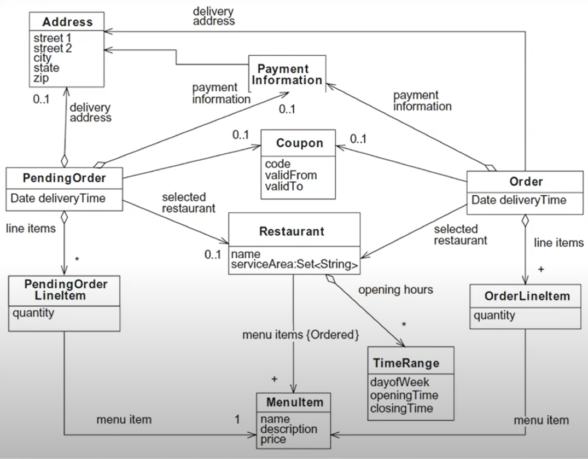

> 백명석 님의 [클린 코더스 강의](https://www.youtube.com/user/codetemplate/videos)를 듣고 요약정리한 글입니다. 문제가 있을 경우 삭제 조치하도록 하겠습니다.

## 1. 클래스, 속성, 관계 식별

클래스, 속성, 관계를 식별한다는 이야기는 일반적인 이야기다. 요구사항 명세에 있는 명사를 식별하는 것으로 시작한다는 것이다. 자세한 내용은 Applying UML and Patterns를 참고하자.

아래 초기 도메인 모델은 Pojos In Action에서 음식 배달에 대한 모델이다. 이는 요구사항 중 정적인 부분들을 추출한 예시이다. 메서드는 없고 클래스와 속성 관계만 명시되어 있다. (정적 모델링)

<figure>

<figcaption>출처 : 백명석님의 클린 코더스</figcaption>
</figure>

## 2. 도메인 모델에 행위 추가하기

정적 모델에 행위를 추가함으로써 도메인 모델에 생명력을 부여한다. 도메인 모델의 행위를 결정하기 위해서 도메인 모델의 책임(아는 것과 하는 것, 결정하는 것들)과 상호작용(책임 수행을 위해서 호출하는 다른 클래스)을 식별한다. 책임과 상호작용을 식별하는 절차는 아래와 같다.

-   요구 사항(유스케이스, 유저스토리, UI 디자인) 분석을 통해 애플리케이션이 처리해야 하는 요구사항 식별
-   도메인 모델의 클라이언트(프레젠테이션 티어 등)에게 도메인 모델을 노출하기 위한 도메인 모델의 인터페이스(타입, 메서드)를 결정
-   해당 인터페이스를 각각의 요구사항을 고려하여 TDD 접근법으로 구현

### 2.1 요구 사항 식별하기

UI 디자인, 유스케이스, 유저스토리 등을 분석하고, 처리해야 할 요구사항을 식별하고 어떻게 응답할지 결정한다. 요구 사항은 2가지 부분으로 구성한다.

-   사용자 행위
-   사용자 행위 요청에 대한 애플리케이션의 응답(책임)

애플리케이션의 책임은 2가지로 그룹핑한다.

-   사용자 입력 검증, 값 계산, 데이터베이스 갱신
-   값 출력

### 2.2 메서드 식별하기

각 요청에 대해 2가지 메서드들이 존재한다. (커맨드와 쿼리)

-   서비스 메서드(사용자 요청 검증, 계산 수행, 데이터베이스 갱신)
-   레파지토리 메서드(출력을 위한 데이터 반환)

도메인 모델의 클라이언트는 도메인 티어를 2번 호출한다. (서비스 + 레파지토리 각 한번씩)

### 2.3 TDD로 메서드 구현하기

대상 서비스 메서드에 대해 하나 이상의 테스트케이스를 작성하는 것으로 시작하며, 각 테스트케이스는 서로 다른 상황을 재현하기 위해 다른 인자로 구성된다. 이때 mock 객체를 이용하면 service method -> repository method 순으로 top-down 방식으로 구현 가능하다. (fitness 예제를 떠올려보자) 구현을 하다가 발견되는 collaborator를 구현하기 위해 머릿속에서 context-switching이 일어날 필요가 없어서 집중하면서 구현할 수 있다.

### 메모

책임 주도 설계 + 정적 모델 + 동적 모델을 연관 지어서 생각해 보자. 객체 지향의 사실과 오해 3장 참고하면 될 듯!