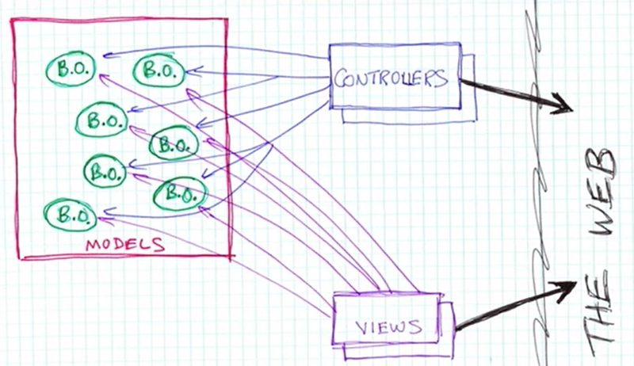
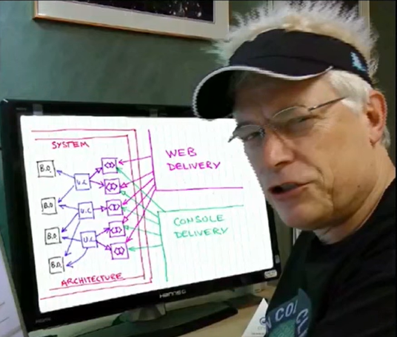
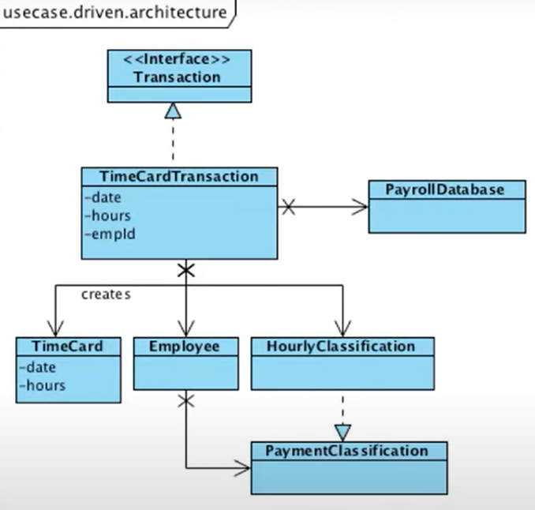
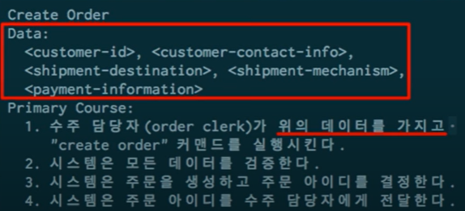
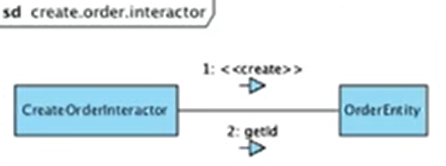
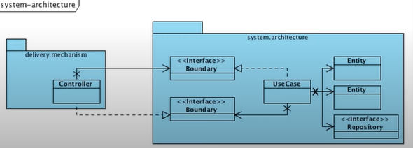
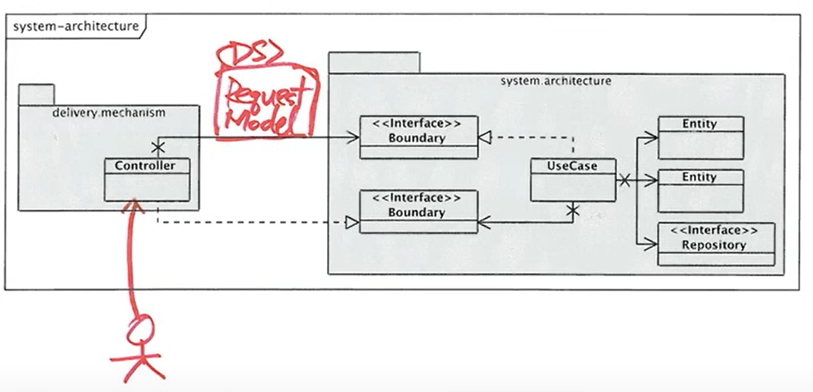
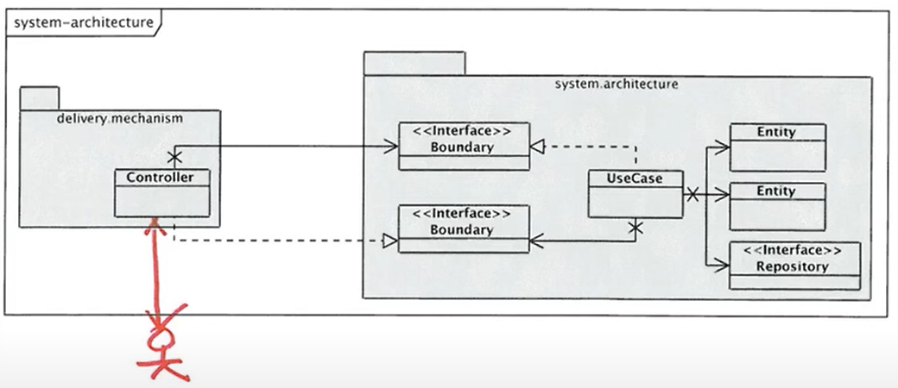
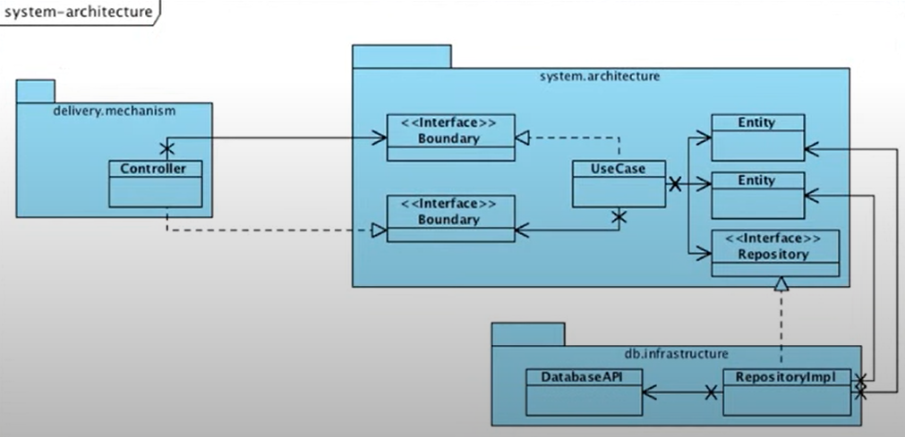

> 백명석 님의 [클린 코더스 강의](https://www.youtube.com/user/codetemplate/videos)를 듣고 요약정리한 글입니다. 문제가 있을 경우 삭제 조치하도록 하겠습니다.

## 1.  Architecture

Web 기반 Accounting 시스템의 아키텍처에서 주목해야 할 부분 당연히 Accounting 시스템이다. Web에 대해서는 거의 언급하지 않아야 한다. 하지만 대개의 Web 시스템은 반대편에 주목한다. 즉, 비즈니스 의도에 대해서는 거의 언급하지 않는다.

## 2. Web 시스템에 만연하는 MVC Architecture

<figure>

<figcaption>출처 : 백명석님의 클린 코더스</figcaption>
</figure>

-   View/Controller : 강하게 html과 연관
-   Model : Controller에 강하게 연관
-   View/Controller : 강하게 모델에 coupling

뷰나 컨트롤러는 html, http와 강하게 연관되어 있다. 그리고 모델은 컨트롤러에 의존한다. 컨트롤러가 요구하는 기능을 잘 제공해야 하기 때문이다. 이렇게 되면 모델은 순수하게 pojo가 아니라 http, html에 의존적인 코드가 들어가게 된다. 더 이상 모델이 아니다. web mvc에서 모델은 순수할 수 없다. 지금 이 시스템의 구조는 모델이 중심이 아니라 웹이 중심이라 웹에 의해 모델이 오염된다.

## 3. Accounting System Architecture

<figure>

<figcaption>출처 : 백명석님의 클린 코더스</figcaption>
</figure>

Architecture 변경 없이 우리는 delivery 메커니즘을 변경할 수 있어야 한다. 즉, 동일한 시스템을 웹과 콘솔에 deliver 할 수 있어야 하고, 두 시스템의 아키텍처는 동일해야 한다.

## 4. Use Cases

-   "Object-Oriented Software Engineering - A Use Case Driven Approach", Ivar Jacobson
    -   delibery 문제를 우아한 아키텍처로 해결한다.
    -   delivery와 무관한 방식으로 사용자가 시스템과 상호작용하는 방식을 이해하는 것
    -   링크, 버튼, 클릭 등의 용어를 사용하지 않고 표현해야 한다.
    -   delivery 메커니즘을 나타내지 않는 용어를 사용한다.
    -   제이콥슨은 이런 상호작용을 **use case**라고 한다.
    -   애플리케이션 개발은 delivery와 독립적인 use case에 의해 주도되어야 한다.
    -   use case가 시스템에서 가장 중요한 것이다.

Delivery 메커니즘과의 분리를 통해 얻을 수 있는 것은 요구사항 변경이 있을 때 애플리케이션이 보호받을 수 있다는 측면에서 중요하다. 예를 들어, 코드가 독립 배포 가능할 때 이런 질문을 할 수 있다. "난 war로 배포해서 상관없는데?" 근본적으로 코드가 독립 배포 가능하다는 것은 다른 사람과 독립적으로 개발을 할 수 있다는 뜻이다. ("난 어차피 웹에만 올릴 건데?"라는 질문에 대해서)

## 5. Use Case Driven Architecture

<figure>

<figcaption>출처 : 백명석님의 클린 코더스</figcaption>
</figure>

use case driven 시스템의 아키텍처를 보면 delivery 메커니즘이 아닌 use case를 보게 된다. 독자가 보게되는 것은 시스템의 의도이다. TimeCardTransaction은 Use case를 추상화한 클래스이다. TimeCard라는 행위가 있는 것이다. (직원이 아침에 카드를 찍는 것) 이처럼 애플리케이션 로직을 구현한 게 TimeCardTransaction이다. 다른 도메인 모델들과도 상호작용을 하는 것을 알 수 있다. 중요한 건 웹이 어쩌고가 보이지 않는다.

사용자가 특정 목적을 이루기 위해 시스템과 어떻게 상호작용하는지에 대해 형식적으로 기술한 것을 use case라고 한다. use case의 명세의 예시는 아래와 같다. 사용자와 시스템 간의 상호작용을 담는 명세도 있다. 스스로 선택하자.

<figure>

<figcaption>출처 : 백명석님의 클린 코더스</figcaption>
</figure>

use case는 시스템으로 들어가는 데이터, 커맨드와 시스템이 응답하는 것만 언급한다.  delivery 메커니즘과 무관한 아키텍처를 가지려면 delivery 메커니즘과 무관한 use case로 시작해야 한다. 여기서 use case의 응답도 주목할 필요가 있다.

-   create order를 수행할 때, order-id는 완전하게 delivery 메커니즘과 무관하다.
-   human clerk은 order-id를 볼 필요가 없다.
-   반면 delivery 메커니즘은 팝업을 띄워서 사용자에게 항목을 주문에 추가하라고 요청할 수 있다.

즉, 포스기가 받던, 사람이 받던 신경쓰지 않고, 응답한다. (delivry 메커니즘에 무관) 또한 use case는 입력 데이터를 해석하여 출력 데이터를 생성하는 필수 알고리즘이다. (validate, calculate, update) 그리고 이런 use case를 구현하는 객체를 생성할 수 있다는 것을 의미한다.

## 6. Use Case Algorithm

use case algorithm은 다른 비즈니스 객체들(Customer, Order)을 언급한다. 그리고 알고리즘은 use case를 정의하고 비즈니스 규칙을 내포한다. 하지만 이런 비즈니스 규칙은 Customer나 Order 객체에 속하지 않는다. 예를 들어, create order를 하기 위해 customer id가 있어야 하고, 상품 코드, 상품 개수를 알아야 하는데 Customer는 상품에 대해서 잘 모른다. 한 객체에게 줄 수 없는 책임이 있다.  그럼 다음과 같은 질문을 떠올릴 수 있다.

-   그럼 어디에 비즈니스 규칙을 내포시킬 것인가?
-   어떤 객체에 위치시킬 것이며 use case 객체를 아키텍처의 어디에 위치시킬 것인가?
-   어떻게 우리의 시스템을 분할해서 use case가 central organizing principle이 되게 할 것인가?

결론은 여러 객체들이 협업 해야하는 비즈니스 규칙들을 use case 객체라는 곳에  위치시켜야 한다.

## 7. Partitioning

야콥슨이 말하길 아키텍처는 3개의 fundamental kinds object들을 갖는다고 한다.

-   Business Objects - Entities라고 불리는 (엔티티, 레파지토리, VO)
-   UI Objects - Boundaries라고 불리는 (UI에서 사용하는 오브젝트, DTO)
-   Use Case Objects - Controller라고 야콥슨이 부름, 하지만 MVC와 혼동을 피하기 위해 밥아저씨는 Interactors라고 부름

Entities have :

-   application 독립적인 비즈니스 로직을 갖는다.
-   다른 application에서도 entity 들은 사용됨
-   특정 application에 특화된 메서드를 가지면 안 됨 (이런 메서드들은 interactor로 옮겨야 함) 

주문이라는 도메인에는 어디에나 order가 있을 거다. 하지만, a라는 회사에서 만드는 주문 시스템이랑, b라는 회사에서 만드는 주문 시스템은 다르다. 같은 도메인인데 시스템이냐에 따라 다른 부분을 애플리케이션 로직이라고 할 수 있다. 반면, 도메인이 같으면 같은 로직을 비즈니스 로직/도메인 로직이라고 할 수 있다.

Interactors have :

-   application 종속적인 비즈니스 로직
-   특정 application에 특화된 메서드들은 interactor 객체에 구현해야 한다.

interactor는 application에 특화된 로직을 통해서 목적을 달성한다.

-   application과 무관한 entity 로직을 호출
-   ex) CreateOrderInteractor
    -   Order의 생성자
    -   Order의 getId를 호출

<figure>

<figcaption>출처 : 백명석님의 클린 코더스</figcaption>
</figure>

이 두 메서드는 application 로직과 무관하다. use case의 목적을 달성하기 위해 이러한 메서드들을 어떻게 호출하는지 아는 것이 Interactor의 책임이다.

use case의 책임 중 하나는 사용자로부터 입력을 받고, 결과를 다시 사용자에게 반환하는 것이다. 이를 위해 boundary object가 존재한다. 이 이후 인터페이스들은 dto들을 파라미터로 받거나 결과로 줘야 한다. 예를 들어, 서비스 인터페이스 파라미터는 네이티브 거나 dto여야 한다.

<figure>

<figcaption>출처 : 백명석님의 클린 코더스</figcaption>
</figure>

Boundary object를 둠으로써..

-   use case를 delivery 메커니즘으로부터 격리할 수 있음
-   use case를 delivery 메커니즘 간의 통신 수단 제공
-   MVC / Console / Thick Client 등은 Boundary의 반대편에 존재함
-   use case는 이러한 delivery 메커니즘에 대해 모른 체 boundary의 또 다른 반대편에 존재

## 8. Partitioning - Flow

<figure>

<figcaption>출처 : 백명석님의 클린 코더스</figcaption>
</figure>

1.  delivery 메커니즘은 사용자의 요청을 수집하고, 요청을 표준적인 형식(RequestModel, DTO)으로 표현한다. 이후에 Boundary를 통해 RequestModel을 Interactor로 전달한다.
2.  이후 Interactor는 application 특화된 비즈니스 로직을 수행하거나, Entity를 조작해 application 독립적인 비즈니스 로직을 수행한다. 
3.  그 결과를 수집해서, 표준적인 형식(ResultModel)을 생성한다.

## 9. Use Cases and Partitioning

-   우리는 시스템의 행위를 use case로 기술한다.
-   use case에서 application 특화된 행위를 interactor 객체로 캡처한다.
-   application 무관한 행위를 entity 객체로 캡처하고 interactor로 제어한다.
-   ui 종속적인 행위는 boundary 객체로 캡처하여 interactor와 커뮤니케이션한다.

## 10. Isolation

<figure>

<figcaption>출처 : 백명석님의 클린 코더스</figcaption>
</figure>

delivery 메커니즘을 분리하기 위해서는 소스 코드 의존성은 하나의 방향만 유지해야 한다.

## 11. Database

<figure>

<figcaption>출처 : 백명석님의 클린 코더스</figcaption>
</figure>

비즈니스 객체가 아니라 Data Structure를 포함한다. 데이터가 저장되는 방식은 Interactor나 Entity가 원하는 방식이 아니다. 그러므로 DB와 Entity 간의 Boundary Layer를 제공해야 한다. (DIP)

## 12. 결론

-   "Agile software Development - Principles, Patterns and Practices"
-   Architecture는 툴이나 프레임워크에 기반하지 않는다.
-   시스템의 모양을 보면, web 시스템인지 여부를 알 수 없어야 한다.
-   시스템의 use case는 주요한 추상화(primary abstraction)이고, 시스템 아키텍처를 구성하는 핵심적인 원칙이다.
-   아키텍처를 보면 UI가 아니라 시스템의 의도를 볼 수 있어야 한다.
-   Use case 지향 아키텍처를 만들기 위한 야콥슨의 Boundary, INteractor, Entity partition을 배웠다.
-   Interactor가 use case를 캡슐화하고 entity는 비즈니스 객체를 캡슐화하고, boundary는 ui와 격리를 제공한다.
-   격리를 얻기 위해 application을 delivery 측과 분리하는 boundary 인터페이스를 생성한다.
-   좋은 Architecture은..
    -   툴이나 프레임워크에 대한 결정을 아주 오랫동안 미룬다. 
    -   이행되지 않은 결정의 개수를 최대화한다.
    -   delivery 메커니즘에 의존하지 않고, 노출시키지 않고 숨긴다.

## 13. 그래서 아키텍트는?

-   많은 회사들이 상위 레벨 기술 역할로 아키텍트를 규명했다.
-   가끔 이 역할은 기술적이라기보다 정치적이거나 관료적이다.
-   Sales나 management의 입장을 대변하거나 프레임워크를 옹호하거나 한다.
-   이런 것들이 필요하긴 하지만 아키텍트랑은 별 상관이 없다.
-   회사들은 시니어 개발자를 아키텍트로 승진시킨다.
-   아키텍트가 코딩을 하는 것을 원하지 않는다. 좀 더 high level의 뭔가(디자인, 리뷰 등)를 하길 원한다.
-   이런 정의들은 아키텍트가 코딩을 안 한다는 것을 가정한다.
-   코딩은 아키텍트가 하기에는 아주 low level의 일이라고 생각한다.
-   하지만, 코딩하지 않는 아키텍트는 무능해진다.
-   코딩 잘 못하는 아키텍트의 설계는 무용지물이다.
-   당신이 아키텍트이고 효과적으로 그 역할을 수행하길 원한다면. 코드를 작성해야만 한다. 그리고 프로그래머들과 함께 일해야만 한다. 또한, 같이 페어 프로그래밍 해야 한다.
-   100%의 시간을 코딩에 쓸 필요는 없다.
    -   심지어 50%의 시간을 코딩에 쓸 필요도 없다.
    -   하지만 약간의 시간이라도 코딩을 해야 할 때면
        -   you should code well.