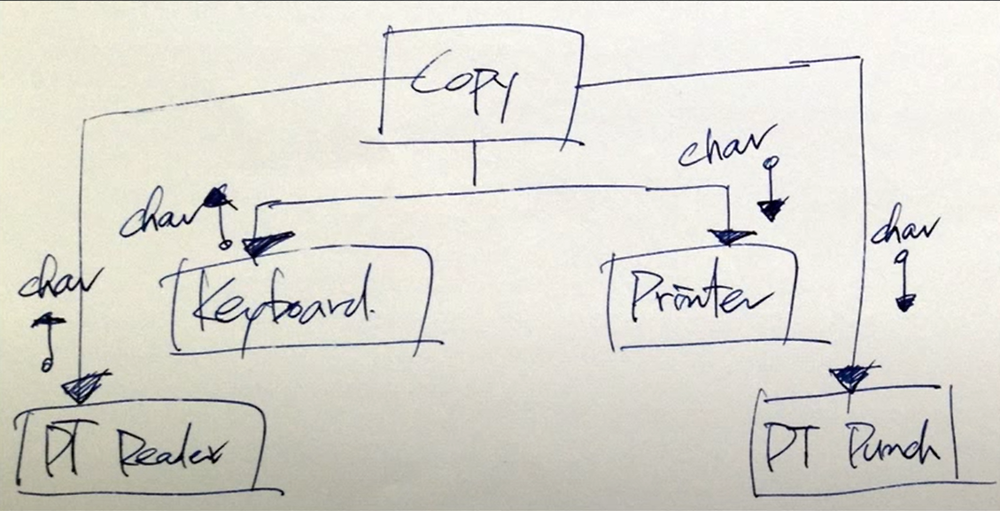

> 백명석 님의 [클린 코더스 강의](https://www.youtube.com/user/codetemplate/videos)를 듣고 요약정리한 글입니다. 문제가 있을 경우 삭제 조치하도록 하겠습니다.

## 1. The Source code is the Design

1992, "What is Software Design?" by Jack W. Reeves

-   Q : What do Engineers produce?
-   A : Engineers produce documents.

소프트웨어 공학의 결과물은 소스코드가 아니다. 소프트웨어 공학의 결과물은 실행하는 바이너리 코드이다. 그리고, 소스코드는 document이다. 공학자는 설계 문서를 만들어야 하는데, 소프트웨어 공학자가 만들어야 하는 것은 UML이 아닌 소스코드이다. (The source code is the design)

건물이나 회로, 기계는 변경에 대한 설계 비용이 저렴하다. 하지만, 생산 과정(빌드)에서는 수정 비용이 비싸다. 반면 소프트웨어는 구축 비용이 저렴하다. (컴파일, 빌드) 그리고, 소스 코드 작성과 같은 설계 비용은 비싸다.  소프트웨어 공학에서는 건축에 있는 아키텍처를 많이 차용하는데 집을 짓는 전략과 소프트웨어를 만드는 전략을 달라야 한다. 전통적인 건축에 기반한 프로세스로는 요즘 사용자의 니즈를 만족시킬 수 없다.

## 2. Design Smells

아래 같은 특성이 보이면 코드가 잘못 작성되고 있다는 뜻이다. 

-   Rigidity
-   Fragility
-   Immobility

### Design Smells - Rigidity

**의미 :** 시스템의 의존성으로 인해 변경하기 어려워지는 것

**원인 :**

-   많은 시간이 소요되는 테스트와 빌드
-   전체 리빌드를 유발하는 아주 작은 변화(의존성 관리를 잘못함)

**해결 :** 테스트와 리빌드 시간을 줄이면 Rigidity를 줄이고 수정이 용이해진다. SOLID로 해결 가능

### Design Smells - Fragility

**의미 :** 한 모듈의 수정이 다른 모듈에 영향을 미치는 것 예를 들어, 자동차를 SW로 제어하는 상황에서 라디오버튼을 수정했는데, 창문이 영향을 받는 경우

**해결 :** 모듈 간의 의존성을 제거하는 것. 런타임 의존성은 어쩔 수 없지만, 소스 코드 의존성은 항상 제거할 수 있다.

### Design Smells - Immobility

**의미 :** 모듈이 쉽게 추출되지 않고 재사용되지 않는 것. 예를 들어, 로그인 모듈이 특정 DB의 스키마를 사용하고, 특정 UI skin을 사용하는 경우. 로그인 모듈은 다른 시스템에서 재사용하지 못한다.(immobile)

**해결 :** DB, UI, Framework 등과 결합도를 낮춰서 해결 가능하다. 이러한 디테일한 요소들과는 인터페이스를 통해 절연돼야 한다.

## 3. Design Smells 이외의 것들

### Viscosity(점성)

빌드/테스트 같은 필수 오퍼레이션들이 오래 걸려 수행이 어렵다면 그 시스템은 역겨운(disgust) 것이다. 

-   체크인, 체크아웃, 머지등은 비용이 크고 역겨움
-   여러 레이어를 가로질러 의존성을 갖는 것은 역겨움. 레이어 간의 의존성은 없어야 한다. 레이어드 아키텍처를 이야기할 때, 상위 레이어가 하위 레이어를 호출할 수 있다는 것은 런타임 의존성을 이야기하는 것이다. 소스 코드 의존성이 생기면 역겨워진다.

그리고 항상 역겨움이 생기는 원인은 **무책임한 용인(Irresponsible tolerance)**이다. 개발자가 나빠질 것이라는 것을 알면서도 아무것도 안하는 것을 의미한다. 강하게 결합된 시스템은 테스트, 빌드, 수정을 어렵게 한다. 이를 해결하기 위해서는 의존성은 유지한 채로 분리하는 것이다. (컴파일 시간 의존성을 decouple)

### Needless Complexity(불필요한 복잡성)

진화적 설계란 디자인하고 개발하는 것이 아닌 리팩토링을 하다보니 디자인이 나오는 것을 의미한다. 그리고 아키텍처는 처음부터 명확한 그림을 가지고 가는 게 아니라, 몇 가지 원칙들을 지키다 보면 진화적으로 나오게 된다.

 요구사항이 너무 자주 변하다보니, 미래를 예측하고, 확장을 고려해 설계한다. 따라서 불필요하게 시스템이 복잡해지고, 개발자는 현재를 제어할 수 없게 된다. 불필요한 복잡함은 강한 커플링을 만든다. 현재 요구 사항에만 집중하자. 중요한 것은 현재를 잘해야 한다는 것이다. (변경을 빠르게, 테스트가 잘되게..)

## 4. 예제 - Code Rot

### Code Rot v1

키보드 입력을 받아 프린터로 출력하는 프로젝트다. 

-   월요일, 아침에 보스는 개발자에게 만드는데 얼마나 걸릴지 물어본다. 개발자는 6개월을 예상하지만 3주라고 답변
-   개발자는 다이어그램을 그려본다. 다이어그램은 상위 레벨 정책이 된다.
-   화요일, 컴파일 하려는데 일이 생긴다.
-   수요일, 현장에서 큰 버그가 생겨 하루가 또 간다.
-   목요일, 드디어 테스트, 처음으로 실행. 하지만 또 미팅
-   금요일, 회의도, 버그도 어떠한 방해가 없지만 소스코드 시스템에서 코드를 받는데 하루가 간다. (아직 2주 남았다..!) 

```java
public void copy() {
    int c;
    while ((c = readKeyboard()) != EOF) {
        writePrinter(c);
    }
}
```

### Code Rot v2

새로운 요구사항이 생겼다. 입력 도구가 2가지가 됐다.(키보드, 종이 테이프 리더기)

-   그냥 글로벌 플래그나 하나 만들자.

```java
private boolean GptFlag = false;
// Remember to clear

public void copy() {
    int c;
    while ((c = (GptFlag ? readPt() : readKeyboard())) != EOF) {
        writePrinter(c);
    }
}
```

### Code Rot v3

새로운 요구사항이 생겼다. 출력 도구가 2가지가 됐다.(프린터, 종이 테입 펀처)

-   그냥 글로벌 플래그 하나 더 만들자.

```java
private boolean GptFlag = false;
private boolean GpunchFlag= false;
// Remember to clear

public void copy() {
    int c;
    while ((c = (GptFlag ? readPt() : readKeyboard())) != EOF) {
        if(Gpunchflag)
            writePunch(c);
        else
            writePrinter(c);
    }
}
```

### Code Rot - Summary

점점 갈수록...

-   점점 더 많아지는 입출력 장치
-   점점 더 커지는 코드
-   점점 더 지저분해지는 코드
-   변경/분석이 어려워짐
-   가독성/유연성 저하

### 만약 OOP로 했다면?

```java
public void copy() {
    int c;
    while ((c = getChar()) != EOF)
        putChar(c);
}
```

OOP 스타일로 했다면 위 코드에서 변하지 않았을 것이다. 이렇게 되면 장치 추가에 따른 코드 품질이 저하되는 현상을 제거할 수 있고, 재컴파일 하지 않아도 된다.

## 5. Procedural

아래는 첫번재 버전의 다이어그램이다. (High Level depends on Low Level)

<figure>

<figcaption>출처 : 백명석님의 클린 코더스</figcaption>
</figure>

입출력 장치들이 변경되면 Copy를 변경돼야 한다. (fan out problem)

<figure>

<figcaption>출처 : 백명석님의 클린 코더스</figcaption>
</figure>

## 6. OOP

Copy는 인터페이스에 정의되어 있는 getChar, putChar에만 의존한다. (High Level don't depends on Low Level) 오히려 Low Level depends on High Level임

<figure>

<figcaption>출처 : 백명석님의 클린 코더스</figcaption>
</figure>

즉, OOP는 의존성이 역전된다. 상위 레이어(Copy, File)에서 하위 레이어(KeyBoard, Printer)로 런타임 의존성은 흐르지만, 소스 코드 의존성은 하위 레이어에서 상위 레이어로 흐른다. fan-out 문제가 발생하지 않으므로 상위 레이어는 안전해진다.

<figure>

<figcaption>출처 : 백명석님의 클린 코더스</figcaption>
</figure>


OOP는 Reader/Writer 메서드를 가지고 있는 Interface를 이용해서 IoC를 구현한다.

> 전략 패턴(소유)과 템플릿 메소드(상속) 패턴은 가장 소극적인 제어역전 패턴임

```java
public interface Reader {...}
public interface Writer {...}

public void copy(Reader reader, Writer writer) {
    int c;
    while ((c = reader.getChar()) != EOF)
        writer.putChar(c);
}

public class Keyboard implements Reader {...}
public class Printer implements Writer {...}
```

## 7. What is OO ?

-   o.f(x) != f(o,x)일 때, 왼쪽이 객체지향이다.
-   Dynamic polymorphism(메시지를 수신하는 애가 어떻게 동작하는지는 모르고, 무슨 일을 해줄지 안다.)
-   OO는 메시지를 전달하는 것이다.
    -   어떻게 동작하는지 모르고
    -   무엇을 원하는지를 전달하는 것

객체지향의 정수는 Dependency Inversion이다.

<figure>

<figcaption>출처 : 백명석님의 클린 코더스</figcaption>
</figure>

객체지향의 핵심은...

-   IoC를 통해 상위 레벨의 모듈을 하위 레벨의 모듈로부터 보호하는 것이다.
-   Inverted structure tends not to rot

객체지향설계의 핵심은...

-   Dependency Management
-   Inversion of key dependencies that isolate the high level policies from low level details

의존성 관리를 잘하려면.. 의존성 관리에 대한 중요한 규칙인 SOLID를 준수해야 한다.

-   SRP : Single Responsibility Principle
-   OCP : Open Closed Principle
-   LSP : Liskov Substitution Principle
-   ISP : Interface Segregation Principle
-   DIP : Dependency Inversion Principle