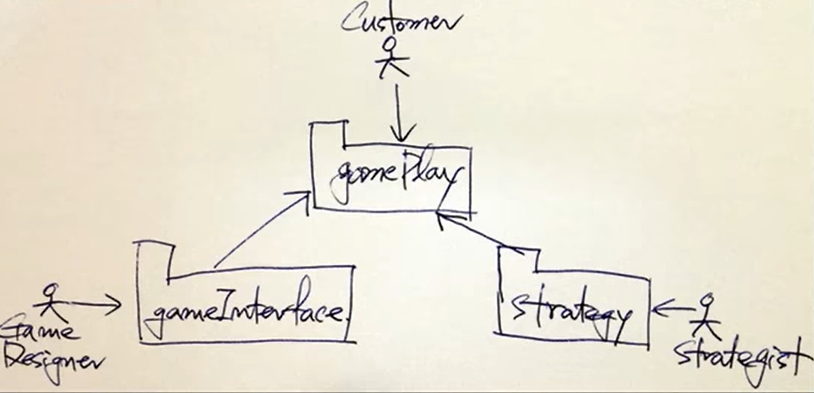

> 백명석 님의 [클린 코더스 강의](https://www.youtube.com/user/codetemplate/videos)를 듣고 요약정리한 글입니다. 문제가 있을 경우 삭제 조치하도록 하겠습니다.

## 1. Responsibility

클래스는 하나의 책임을 가져야 한다. 메서드가 추가된다고 해도 메서드 개수만큼 책임이 증가하는 것이 아니다.

<figure>

<figcaption>출처 : 백명석님의 클린 코더스</figcaption>
</figure>

-   save와 findById는 같은 부류
-   calculatePay와 같은 부류인 calculateDeduction, calculateSalary를 추가를 해도 책임이 증가하는 것이 아니다.
-   부류는 어떻게 정해지는 가?
    -   메서드의 클라이언트에 의해 결정된다.
    -   누가 해당 메서드의 변경을 유발하는 사용자인가?

### It's About Users

SRP에서 책임은 사용자에 관한 것이다.

-   책임이란 SW의 변경을 요청하는 특정 사용자들에 대해 클래스/함수가 갖는 것이다.
-   "변경의 근원"으로 볼 수 있다.

<figure>

<figcaption>출처 : 백명석님의 클린 코더스</figcaption>
</figure>

Actor 들은 서로 다른 Needs와 Expectation을 가진다.

-   User들을 그들이 수행하는 **Role**에 따라 나눠야 한다.
-   User가 특정 Role을 수행할 때 **Actor**라고 부른다. 그리고 책임은 개인이 아니라 액터와 연결된다.
-   Employee 클래스에는 3개의 액터가 있다. (Policy, Architect, Operations)
-   Actor에 대한 요구사항이 변경되면, Actor가 사용하는 메서드들의 집합이 변경된다.

### Reprise

Responsibility

-   특정 액터의 요구사항을 만족시키기 위한 일련의 함수의 집합
-   Actor의 요구사항 변경이 일련의 함수들의 변경의 근원이 된다.

### Two Values of SW

-   Primary and Secondary Values
-   Secondary value of SW it it's behavior ( 현재 SW가 현재 사용자의 현재 요구사항을 만족하는가?)
-   대부분의 사람들은 잘 돌아가는 것을 제일 중요한 가치라 생각한다. 하지만 그것은 2순위 가치이다.
-   Primary value of SW
    -   지속적으로 변화하는 요구사항을 수용(tolerate, facilitate) 하는 것
    -   대부분의 SW의 경우 현재의 요구사항을 잘 만족하지만 변경하긴 어렵다. 

### Collision

<figure>

<figcaption>출처 : 백명석님의 클린 코더스</figcaption>
</figure>

-   Policy Actors : business rule의 변경을 필요로 함
-   Architecture Actors : DB Schema 변경을 필요로 함
-   Operations Actors : Business rule 변경을 원함
-   동일 모듈의 변경, Merge 충돌, Source Repo 충돌(Primary Value 저하)

### Fan Out

현재 Employee는 Business rules, DB, Reports, formatting 등 너무 많은 것을 안다. 또한 많은 책임을 갖는다.  각 책임은 Employee가 다른 클래스들을 사용하도록 한다.

<figure>

<figcaption>출처 : 백명석님의 클린 코더스</figcaption>
</figure>

-   Emplyoyee 클래스에 거대한 Fan Out이 존재한다.
-   변경에 민감하고, Employee User(클라이언트)는 더 민감하다.
-   Fan Out을 제한해야 하는데, 좋은 방법은 책임을 최소화하는 것이다. (SRP)

### Collocation is Coupling

> Collocation of responsibilities couples the actors

만약 Operations Actor가 새로운 리포트 기능을 필요로 한다. 그렇다면...?

1.  새로운 리포트 기능도 Employee 클래스에 추가한다.
2.  기존 책임(Policy, Architecture)에는 변경이 없음에도 새로운 리포트가 추가되어 Employee 클래스가 변경된다.
3.  새로운 리포트 기능이 Employee 클래스에 추가되면 이 기능을 필요로 하지 않는 Employee 클래스를 사용하는 모든 클래스들이 다시 컴파일/배포되어야 한다.
4.  모든 액터들이 영향을 받게 된다.

## 2. SRP

모듈은 반드시 하나의 변경 사유를 가져야 한다. (One and only one responsibility)

-   동일한 이유로 변경되어야 하는 것들은 동일 모듈에
-   다른 이유로 변경되어야 하는 것들은 다른 모듈에
-   즉, 하나의 클래스는 한 종류의 클라이언트들에게만 서빙해야 한다.

<figure>

<figcaption>출처 : 백명석님의 클린 코더스</figcaption>
</figure>

SRP는 시스템 설계할 때 적용하기 좋다. 즉, 처음에 Actor와 Usecase를 찾을 때 SRP를 잘 생각할 수 있다.

-   Actor 파악에 주의해야 함
-   Actor들을 serve하는 책임들을 식별
-   책임을 모듈에 할당 (각 모듈이 반드시 하나의 책임을 갖도록 유지하면)
-   만약 분리를 해야 한다면 그 이유는 다른 이유로 변경되거나, 다른 때에 변경되기 때문이다.

## 3. Solutions

<figure>

<figcaption>출처 : 백명석님의 클린 코더스</figcaption>
</figure>

3개의 액터와 3개의 책임이 하나의 클래스에 있다. 이를 어떻게 해결할 수 있을까? 여러 방법이 존재한다.

### Inverted Dependencies, 의존성 역전

<figure>

<figcaption>출처 : 백명석님의 클린 코더스</figcaption>
</figure>

-   OOP에서 이런 의존성을 다루는 전략으로, 클래스를 인터페이스와 클래스로 분리한다.
-   요구사항이 변경되어 EmployeeImple이 변경되어도 Employee라는 인터페이스가 변경되지 않으면 다른 액터들은 영향을 받지 않는다.
-   Actor를 클래스에서 Decouple 한다.
    -   하지만.. 모든 Actor들이 하나의 인터페이스에 coupled
    -   그리고.. 하나의 클래스에 구현되어 구현도 coupled
    -   그래도.. 레거시를 다룰 때 좋은 방법 중 하나

### Extract Classes, 클래스 추출

<figure>

<figcaption>출처 : 백명석님의 클린 코더스</figcaption>
</figure>

-   3개의 책임을 분리하는 방법이다. (3개의 클래스로 분리)
-   결과
    -   Actor들은 분리된 3개의 클래스에 의존한다. (상호 간섭 x)
    -   3개의 책임에 대한 구현은 분리
    -   하나의 책임의 변경에 다른 책임에 영향을 안 미친다.

하지만... 문제는 존재한다. 

-   Transitive dependency(EmployeeGateway/EmployeeReporter -> Employee) : Employee 가 변경될 경우, Gateway와 Reporter에 영향을 줄 수 있다.
-   Employee의 개념이 3개의 조각으로 분리

> 의존성 역전과 합치면 각자의 문제점을 보완할 수 있다. 인터페이스를 추출하고, 인터페이스를 3개로 분리한다. 그다음 impl 클래스가 세 개의 인터페이스를 구현하거나 아니면 3개의 impl 클래스로 나눠도 된다.

### Facade, 어디에 구현이 있는지 찾기 쉽게

<figure>

<figcaption>출처 : 백명석님의 클린 코더스</figcaption>
</figure>

-   put all 3 function families into a facade class
-   Facade delegates to the 3 different implementations
-   어디에 구현되었는지 찾기 쉽다는 장점이 있다.

하지만, 여전히 Actor들은 여전히 결합되어 있다는 단점이 있다. 결합을 끊으려면 interface를 만들어야 한다. 그리고 인터페이스의 변경이 다른 Actor에게 영향을 주지 않으려면 인터페이스도 나눠야 한다.  이를 interface segregation이라 한다.

### Interface Segregation, 인터페이스 분리

<figure>

<figcaption>출처 : 백명석님의 클린 코더스</figcaption>
</figure>

-   Create 3 interfaces for each responsibility
-   3개의 인터페이스를 하나의 클래스로 구현
-   장점으로 Actor들은 완전히 decoupled 
-   하지만, 어디에 구현되었는지 찾기 어렵고(해결 어려운 부분), 하나의 클래스에 구현되어 구현은 결합된다는 단점이 존재(이 부분은 impl을 여러 개로 추출하면 해결 가능)
-   interface segregation 이 제일 좋지만, 문제는 인터페이스를 사용하도록 바꾸는 비용이 크다. 
-   정답은 없다. (명석님은 interface segregation이 제일 맘에 든다고 했음)

## 4. Case Study

무엇인가를 변경할 때는 다른 Actor들에 영향을 주지 않고 변경해야 한다. 게임 설계 사례를 보자.

### Case Study - Architecture

<figure>

<figcaption>출처 : 백명석님의 클린 코더스</figcaption>
</figure>

-   Customer Actor를 위한 Responsibility가 애플리케이션 아키텍처의 중심
-   각 패키지는 각 액터들을 위한 책임을 구현한다.
-   패키지 간의 의존성 방향에 주의한다. (모두 Game Play로 향한다.)
-   이 설계는 좋은 아키텍처다
    -   애플리케이션이 중앙에, 다른 책임들은 애플리케이션에 plug into

### Case Study - Design

<figure>

<figcaption>출처 : 백명석님의 클린 코더스</figcaption>
</figure>

-   각 패키지에서 중요한 클래스들이 하나의 액터만을 위한 기능을 제공한다. (하나의 클래스는 반드시 하나의 책임만을 가진다.)
-   패키지간의 의존성에 유의하자. 의존성이 단방향으로 흘러야 좋은 아키텍처이다.

## 5. Faking It!

> Waterfall 순서: 액터 -> 패키지 다이어그램 -> 클래스 다이어그램 -> 코드

위 디자인을 Waterfall 순서로 하거나 step-by-step으로 이 복잡한 것들을 찾아낸 것이 아니다. (그렇게 할 수 있으면 그렇게 해봐라!) 실제로는 다음과 같은 순서로 진행된다.

1.  테스트를 작성하고 통과하도록 함
2.  스코어를 계산하는 동작하는 함수 하나 만들고..
3.  추측하는 로직을 위한 동작하는 함수를 하나 만들고..
4.  설계가 드러날 때까지 이 함수 저 함수를 리팩토링..
5.  동작하는 전체 게임을 얻을 때까지 모든 동작들이 테스트에 성공하도록 설계를 적용
6.  그리고 아키텍처를 살펴봄. 테스트가 당신들에게 보여준 설계의 80%를 유도
7.  테스트가 3개의 책임을 식별하는 것을 도움
8.  unit test가 확보된 후에 무차별적인 리팩토링을 수행. (디자인 향상을 위해)
9.  이런 후에만 3개의 액터들이 식별된다. 그러면 클래스들을 3개의 패키지로 분리시킨다.
10.  마지막으로 이쁜 다이어그램을 그린다. 이쁜 다이어그램을 그리기 가장 좋은 때는 완료된 후이다.

리팩토링 역량이 떨어진다면 unit test에 집중하자. 3개월 후에 리팩토링 역량이 늘어나면 고치면 된다. 처음에는 화이트보드에 막 그리고 이렇게 할 거야~ 하고 나중에 지워버리자.