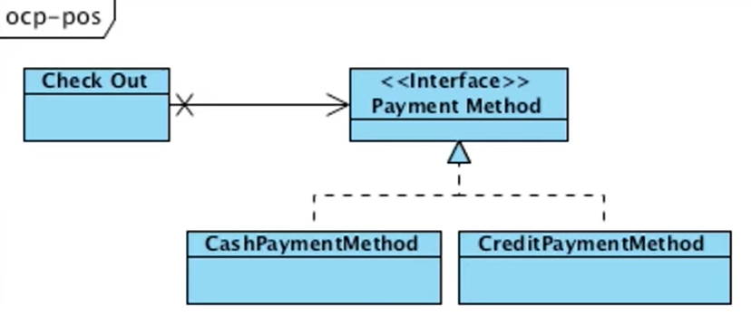

> 백명석 님의 [클린 코더스 강의](https://www.youtube.com/user/codetemplate/videos)를 듣고 요약정리한 글입니다. 문제가 있을 경우 삭제 조치하도록 하겠습니다.

## 1. Open and Closed

개방과 폐쇄라는 개념은 Bertrand Meyer의 "Object-oriented Software Constuction"에서 처음 나왔다.

-   Open for extension : Add a new feature by adding a new type
-   But Closed for modification : High Level Policy shouldn't be modified
-   Easy to change the behavior of the module
-   without having to change the source code of that module

확장이란 새로운 타입을 추가함으로써 새로운 기능을 추가하는 것을, 폐쇄란 확장이 일어날 때 상위 레벨의 모듈이 영향을 받지 않아야 하는 것을 의미한다. 결과적으로 모듈의 행동을 쉽게 변경 가능하다.

## 2. Copy Example

> 기본적으로 스프링과 같은 프레임워크을 사용하는 이유는 오른쪽 사진처럼 만들기 위해 사용한다. (DI 컨테이너)

<figure>


<figcaption>출처 : 백명석님의 클린 코더스</figcaption>
</figure>

-   Copy Module을 컴파일도 안하고 Low Level Details를 변경 가능하다. (예를 들어, 장치를 추가)
-   Abstraction and Inversion
    -   insert abstract interface between copy and device
    -   cause the inverted dependencies

예시 코드를 보자.

```java
public class Copy {
    public void copy() {
        Integer c;
        while((c = readKeyboard()) != null) {
            writePrinter(c);
        }
    }
    
    private void writePrinter(int c) {
        // some logic that write character to printer
    }
    
    private Integer readKeboard() {
        // some logic that read character from keyboard
    }
}
```

만약 새로운 입력 장치가 추가 된다면 확장을 위해서 소스를 수정해야 한다. (OCP 위반)

```java
public class Copy {
    private boolean usePuncher = false;

    public void copy() {
        Integer c;
        while((c = (usePuncher ? readPuncher() : readKeyboard())) != null) {
            writePrinter(c);
        }
    }
    
    private void writePrinter(int c) {
        // some logic that write character to printer
    }
    
    private Integer readPuncher() {
        // some logic that read character from paper tape puncher
    }
    
    private Integer readKeboard() {
        // some logic that read character from keyboard
    }
}
```

대신에 아래처럼 확장이 필요한 행위를 Abstraction 하면 OCP를 달성할 수 있다. 장치가 추가되면 클래스를 추가하면 됨(Open for extension) 반면, copy 로직의 수정이 발생하지 않음(Closed for modification)

```java
interface Reader {
    Integer getChar();
}

interface Writer {
    void putChar(Integer c);
}

public class Copy {
    public void copy(Reader reader, Writer writer) {
        Integer c;
        while((c = reader.getChar()) != null) {
            write.putChar(c);
        }
    }
}

class PuncheReader implements Reader {
    public Integer getChar() {
        // some logic that read character from paper tape puncher
    }
}

class KeyboardReader implements Reader {
    public Integer getChar() {
        // some logic that read character from keyboard
    }
}
class PrinterWriter implements Writer {
    public void putChar(Integer c) {
        // some logic that write character to printer
    }
}
```

## 3. POS Example

```java
void checkOut(Receipt receipt) {
    Money total = Money.zero;
    for(Item item : items) {
        total += item.getPrice();
        reseipt.addItem(item);
    }
    Payment p = acceptCash(total);
    receipt.addPayment(p);
}
```

위와 같은 예시에서는 현찰을 받는 경우는 잘 동작한다. (acceptCach(total)) 하지만 신용카드를 받고자 할때는 확장을 해야 하는데.. acceptCredit을 새로 만들고.. 분기처리하고.. => **OCP 위반**

이때 해결책으로 확장이 필요한 행위를 Abstraction 할 수 있다.

```java
void checkOut(Receipt receipt, PaymentMethod pm) {
    Money total = Money.zero;
    for(Item item : items) {
        total += item.getPrice();
        receipt.addItem(item);
    }
    Payment p = pm.acceptPayment(total);
    receipt.addPayment(p);
}
```

<figure>

<figcaption>출처 : 백명석님의 클린 코더스</figcaption>
</figure>

의존성 변화에 주목해보자. CheckOut 알고리즘은 구현체에 의존하지 않는다. 오히려 PaymentMethod의 구현체들이 Abstraction(PaymentMethod)에 의존한다. CheckOut 모듈의 **수정 없이**, PaymentMethod를 **확장할 수 있다.**

## 4. Is This Possible?

이론적으로는 OCP를 준수하면 수정을 완벽하게 제거할 수 있다. 하지만  두 가지 문제점이 있기 때문에 실용적이지 않다.

<figure>

<figcaption>출처 : 백명석님의 클린 코더스</figcaption>
</figure>

-   Main partition : 결국 어느 부분은 직접 만들어서 주입해야 하잖아.. 분기문 덕지덕지(FW로 해결 가능)
-   Crystal ball problem : 미래를 어캐 예측함.. 미리미리 준비하는 건 불가능

## 5. A Smelly Design - 비용 출력 예제

> Robert C. Martin, expense 예제의 [절차 지향 코드 보러가기](https://github.com/unclebob/Episode-10-ExpenseReport/tree/procedural)

현재 코드를 보면 꽤 복잡하고 이해를 해야 한다. 다행하게도 유닛 테스트가 존재한다. 명석님이 작성한 솔루션은 [이곳](https://github.com/msbaek/expense)에서 볼 수 있다. 

### 문제점, expense 예제의 절차 지향 코드

-   SRP 위반 : 비즈니스 규칙(비용 계산) + 메시지 생성 + 포맷팅
-   OCP 위반 :
    -   비즈니스 규칙을 확장하려면 수정이 필요하다.
    -   메시지 생성/포맷팅을 확장하려면 수정이 필요하다.

### 문제점,  meal type 추가 시 - Rigidity

> 시스템의 의존성으로 인해 변경하기 어려워지는 것을 Rigidity라고 함

<figure>

<figcaption>출처 : 백명석님의 클린 코더스</figcaption>
</figure>

무언가를 고칠 때 많은 곳에 영향을 미치게 되기 때문에 변경이 어려움. 여기서는 case문을 하나 더 추가해야 하고.. 타입을 체크해야 하고.. 계산해야 하고.. 

### 문제점, Fan-out Problem - Fragility

> 한 모듈의 수정이 다른 모듈에 영향을 미치는 것을 Fragility라고 할 수 있음

<figure>

<figcaption>출처 : 백명석님의 클린 코더스</figcaption>
</figure>

모든 Design Smell 중 Fragility가 가장 먼저 제거해야 할 대상이다.

> 현재 ExpenseReport에서 여러 타입의 비용을 의존하기 때문에 Fan-out Problem 인지 의문이 든다. 예를 들어, (DINNER 타입의 expense && amount가 5000 이상) 임을 체크하는 부분을 보면 DINNER 타입에 대한 세부적인 제약을 알고 있어서일까?

### 문제점, 근본적인 비즈니스 변경을 가정해 보자 - Immobility

> 모듈이 쉽게 추출되지 않고, 재사용되지 않는 것을 Immobility라고 할 수 있음. 예를 들어 로그인 모듈이 디테일(UI, DB, FW)과 강하게 결합되어 다른 시스템에서 재사용하기 어려운 경우.

원래는 고객에게 회계 시스템을 제공하기 위한 모든 기능을 처음부터 끝까지 제공하는 기업용 솔루션이다. 만약 새로운 타겟 마켓이 등장하면?

-   새로운 마켓 : 시스템의 대부분의 기능을 필요로 하지 않는 작은 비즈니스 영역
-   대안 : 시스템을 컴포넌트로 분화하기로 결정한다. (작은 모듈로 추출)
-   예시 : 작은 플러그인(식대 계산, 특별 점심 식대, 자동차 렌트 등)들에 대해 비용을 청구하기로
-   문제 : 모듈로 추출하기 어려움 (immobile)
-   원인 : jar를 별도로 판매/배포하는 것이 목표인데, switch/if 문장들에 의존(rigid)하고 있어서 분리가 어려움

### De-Orderizing the Design

위 명석님의 코드에서는 과정이 나오며, 로버트 C. 마틴의 깃에서 다른 브랜치를 열어보면 답을 볼 수 있다. 결과물을 보면 아래처럼 모든 의존성이 Application을 향한다. (경계의 왼쪽이 Application Partition)

<figure>

<figcaption>출처 : 백명석님의 클린 코더스</figcaption>
</figure>

## 6. The Lie

여태 구현한 것과 상관없는 것들이 새로 등장하면, 할 수 있는 것이 없다.

-   만약 고객이 주말(날짜 개념), Transporation 관련된 새로운 기능을 요구하면 대책이 없다.
-   아무도 이런 얘길 해주지 않아서다. 만일 미리 얘기해 줬다면 이런 요구사항을 수용할 수 있도록 Abstraction을 적용했을 것이다.
-   내가 알았더라면 OCP를 준수하도록 했을 텐데... 새로운 기능을 수정 없이 확장할 수 있도록 설계했을 것이란 말이다... 내가 미리 알았다면 말이다.
-   그럼 OCP는 앞으로 어떤 확장이 필요할지 알아야만 제대로 할 수 있다는 말인가? (마법의 수정구)
-   당신이 아무리 잘 찾고, 잘 예측해도 고객은 반드시 당신이 준비하지 못한 것에 대한 기능 추가/변경을 요구한다. (Unknown Unknowns)
-   미래의 변경으로부터 보호받도록 Abstraction을 적용하여 설계하는 것은 쉽다. 하지만 우린 그런 미래를 알 수 있는 Crtstal ball이 없다.
-   고객은 우리가 놓치고 준비하지 않는 부분에 대해서 변경을 요구하는 능력을 가지고 있다.
-   이게 사람들이 말하기를 꺼리는 OCP, OOD에 대한 하나의 더러운 비밀이다.
-   OCP, OOD는 당신이 미래를 예측할 수 있을 때만 해당 기능을 보호할 수 있다.

## 7. Two Solutions

미래를 예측하지 못하는데 어떻게 해야 할까? 완벽한 선견력이 필요하다면 객체지향의 장점은 무엇일까? 이러한 Crystal Ball의 필요성을 제거하기 위한 2가지 주요한 접근법이 있다.

### Big Design Up Front(BDUF)

-   조심스럽게 고객과 문제 영역을 고찰
-   고객의 요구사항을 예측해 도메인 모델을 만듦
-   OCP가 가능하도록 도메일 모델에 추상화 적용
-   변경될 가능성이 있는 모든 것들에 대한 청사진을 얻을 때까지 헛된 짓을 계속

대부분의 경우 필요치 않는 추상화로 도배된 매우 크고, 무겁고 복잡한 쓰레기 설계를 만든다는 문제점이 있다. 추상화는 유용하고 강력하지만, 비용이 크다. + 머피의 법칙 + 이해하기도 어려움

### Agile Design과 은유법

애자일 디자인은 실용적이고, 반응을 하는 방법이다. 은유해 보자.

-   일련의 병사들이 적군의 사격에 포위됨
-   총탄이 난발하고 있는 가운데 참호에 숨어있음
-   적을 향해 집중 사격할 수 있으면 전투에서 승리할 수 있음
-   문제는 어디에 적이 있는지 모름 (BDUF는 행동을 취하기 전에 충분히 계획을 해야 함..!)
-   어떤 방향에서 적들이 총을 쏘는지 모름. 만일 일어나서 방향을 살펴보려고 한다면 적을 찾고 겨냥하기 전에 총에 맞을 것이다.

그럼 애자일은 어떻게 하는가?

-   상사가 실행 가능한 결정을 내린다.
-   "존슨 일어나". 탕탕탕. 이제 총알이 날아온 방향을 안다. (물질적 손실을 이용한 피드백을 의미)
-   애자일 디자인은 이런 것이다.
-   최대한 빨리 고객의 요구사항을 끌어낼 수 있는 가장 단순한 일을 한다.
-   그럼 고객은 그 결과물에 대해 요구사항 변경(사격)을 시작한다.
-   그럼 어떤 변경이 요구되는지 알게 된다.

변경을 예상하고 준비하지 말고, 고객이 원한 것만 만들어서 빨리 전달하고 피드백을 수용하자.

-   변화에 대한 가장 좋은 예측은 변화를 경험하는 것이다.
-   발생할 것 같은 변화를 발견한다면 향후 해당 변화와 같은 종류의 변화로부터 코드를 보호할 수 있다.
-   고객이 요구할 모든 종류의 변경을 완벽하게 예측하고, 이에 대한 변경에 대응하기 위해 Abstraction을 적용하는 대신에 (BDUF)
-   고객이 변경을 요구할 때까지 기다리고 Abstraction을 만들어서 향후 **추가적으로 재발하는 변화**로부터 보호될 수 있도록 하라. (애자일)

그래서! 애자일 방식에서는...

-   애자일 디자이너는 주단위 정도로 간단한 뭔가를 Deliver 한다.
-   고객이 변경을 요구하면 애자일 디자이너는 코드를 리팩터링 해서 그런 종류의 변경을 쉽게 할 수 있도록 Abstraction을 추가한다. (OCP를 준수하도록 + 다른 SOLID도!)

### Agile Design in Practice

-   물론 우리는 실제로 BDUF과 Agile 두 극단 사이에 살고 있다. BDUF를 피해야 하지만, No DUF(화이트보드에 아무것도 안 함!)도 피해야 한다.
-   시스템에 대해서 사고하고 Decoupled 모델을 사전 설계하는 것은 가치 있는 일이다.
-   하지만 간단하고 적은 면에 있다.
-   우리의 목적은 시스템의 기본 모양을 수립하는 것이지 모든 작은 상세까지 수립하는 것은 아니다.
-   문제에 대해서 과하게 생각하면 유지보수 비용이 높은 많은 불필요한 추상화를 만들게 된다.
-   애자일은 무계획을 의미하는 것이 아닌, 움직일 수 있는 최소한의 계획을 세우는 것을 의미한다. (초기에 디테일은 정확하지 않음)
-   빨리 자주 Deliver 하고, 고객의 요구사항 변화에 기반하여 리팩터링 하는 것은 매우 가치 있다.
-   이럴 때 OCP가 진가를 발휘한다.
-   하지만 간단한 도메인 모델 없이 이렇게 진행하면 방향성 없는 혼란한 구조를 유발한다.

## 8. Example

-   팀에 10명의 개발자가 있다고 가정
-   향후 12주 동안 개발할 신규 프로젝트가 주어짐
-   어떤 디자인 프로세스가 OCP에 가장 적합한가?
-   1주를 초기 요구사항의 범위를 한정하는데 보내서 간단한 도메인 모델의 아키텍처를 얻음
-   요구사항은 정확하지 않을 것이고, 도메인 모델은 구체적이지 않음
-   이때도 팀원들은 코딩을 할 수 있다. 하지만, 이때는 구현할 기능이 아니라 초기 요구사항과 아키텍처에 주안 할 것이다.
-   어떤 팀들은 이 시기를 Iteration Zero라고 부른다.
-   유저스토리와 이 유저스토리를 둘러싼 아키텍처는 iteration zero에서 정확하지 않다.
-   iteration zero에서 필요한 것은 앞으로의 진행 방향을 잡는 것이기에 초기의 정확성은 불가능하다. 이후 보정된다.
-   그런 후에 팀은 1-2주 반복을 수행한다. 각 반복의 목적은 고객이나 대리인 앞에서 수행 가능한 뭔가를 얻는 것
-   사용자가 뭔가 동작하는 것을 보면 그들은 생각하기 시작하고 변경한다. 그런 변경이 abstraction의 기반이 된다. OCP를 준수하기 위해 팀은 Abstraction을 사용한다.
-   각 반복은 간단한 디자인 세션으로 시작한다. 팀원들이 요구된 변경을 살펴보고 향후 유사한 변경에 대해서 코드를 보호하기 위해 어떻게 OCP를 적용할 수 있는지 생각한다.
-   그럼 개발자들은 코드를 리팩터링 하고 아키텍처 변경을 염두에 두고 새로운 기능을 추가한다. 개발자들은 TDD를 따라야 한다. 그리고 그들의 코드를 깨끗하고 변경하기 쉽도록 유지해야 한다.
-   iteration이 진행됨에 따라 OCP 적용률이 증가되어야 한다. 각 Iteration은 아키텍처를 기술하는 경계를 명시하고 강조해야 하며, 경계를 교차하는 의존성을 관리해야 한다

## 9. Reprise

소프트웨어 공학은 마술이 아닌 공학이다. 변경에 대한 모든 것을 사전에 모두 생각해 낼 수 없고, OCP를 완벽하게 준수하는 것 또한 불가능하다. 아무리 철저하게 규칙을 준수하고, 조심해도 결국 고객은 수정이 필요한 변경을 생각해낼 것이다.

따라서 개발자는 변경을 완벽히 대비하는 것이 아닌, 변경을 최소화해야 한다. 이것이 OCP를 준수하는 디자인이 개발자에게 주는 이점이다. OCP는 시스템 아키텍처의 핵심이다. **변경으로부터 완벽하게 보호를 받을 수는 없지만 얻기 위해 투쟁할 필요는 있다.**

## 10. Conclusion

> Bertland meyer가 이야기한 "module should be open for extension but closed for modification"는 기존 코드를 수정하지 말고 새로운 코드를 추가함으로써 새로운 기능을 추가하도록 시스템을 만들 수 있다는 것을 의미한다.

OCP에 완벽하게 순응하기 위해서는 미래를 완벽하게 예측할 수 있어야 한다. (하지만 그러긴 힘들지!) 그렇다고 희망이 없는 것은 아니다. 피드백과 리팩토링에 기반한 iteraction 프로세스를 사용함으로써 OCP에 충분히 잘 순응하는 시스템을 만들 수 있다.

## 11. Appendix

사전 설계는 필요 없는가에 대한 이야기. (No DUF를 피하자와 연관)

 [Is Design Dead ?](https://www.evernote.com/shard/s3/client/snv?noteGuid=75aada57-ffdc-4599-b175-d76c8f5e83b0&noteKey=a7121ee62763f92a348fa5f979512f34&sn=https%3A%2F%2Fwww.evernote.com%2Fshard%2Fs3%2Fsh%2F75aada57-ffdc-4599-b175-d76c8f5e83b0%2Fa7121ee62763f92a348fa5f979512f34&title=Is%2BDesign%2BDead%2B%253F)