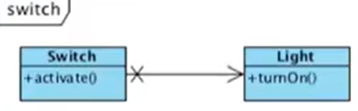
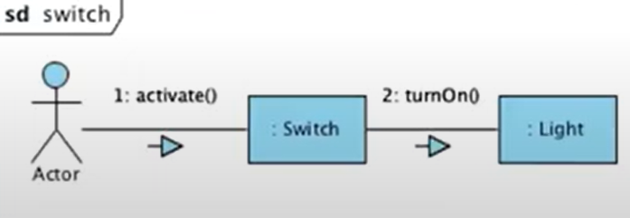
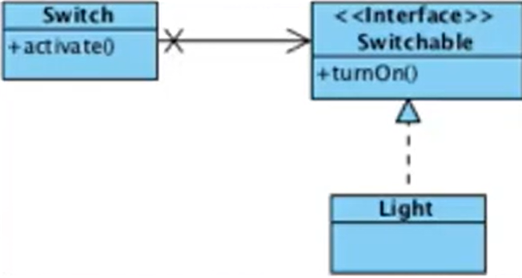
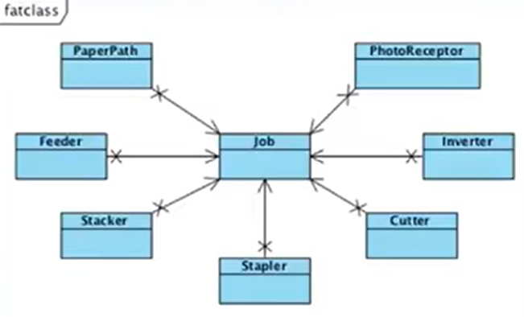
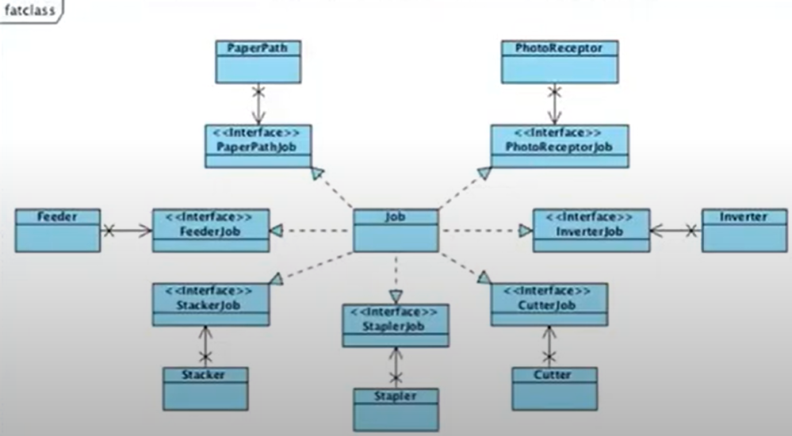

> 백명석 님의 [클린 코더스 강의](https://www.youtube.com/user/codetemplate/videos)를 듣고 요약정리한 글입니다. 문제가 있을 경우 삭제 조치하도록 하겠습니다.

## 1. Interface Segregation Principle

-   Don't depend on things that you don't need
-   사용하지 않지만 의존성을 가지고 있다면 그 인터페이스가 변경되면 재컴파일/빌드/배포된다. 즉, 독립적인 개발과 배포가 불가하다는 의미이다.
-   SRP와도 연관이 있다. SRP 위반한 사례는 한 기능에 변경이 발생하면 다른 기능을 사용하는 클라이언트들에도 영향을 미침. (SRP를 잘 준수하기 위해서 ISP를 적용 가능)
-   사용하는 기능만 제공하도록 인터페이스를 분리함으로써 한 기능에 대한 변경의 여파를 최소화한다.
-   클라이언트 입장에서 인터페이스를 분리하라는 원칙이다.

## 2. Switch 예제

switch가 활성화되면 불을 키는 SW를 설계해 보자.

<figure>


<figcaption>출처 : 백명석님의 클린 코더스</figcaption>
</figure>

```java
public class Switch {
    private Ligth light;
    
    public Switch(Light light) {
        this.light = light;
    }
    
    public void activate() {
        light.turnOn();
    }
}
```

### 문제점

Switch는 Light에 의존적이다. 하지만 Switch는 Light 뿐 아니라 Fan, Motor 등도 활성화할 수 있기 때문에 Switch는 Light에 대해서 알면 안 된다.

### 해결책

<figure>

<figcaption>출처 : 백명석님의 클린 코더스</figcaption>
</figure>

-   Switch는 Light에 대한 의존성을 갖지 않음
-   Switch와 Switcheable이 같은 패키지/배포 단위이다.
-   Interface(Switchable)는..  
    -   클라이언트(Switch)에 속한다.
    -   구현체(Light)와는 관련이 없다.
    -   따라서 인터페이스의 이름은 클라이언트와 연관된 것이어야 한다.

ISP를 설명하는 하나의 예시이다. 좀 더 직관적인 예제를 보자.

### 3. Fat class 예제

<figure>

<figcaption>출처 : 백명석님의 클린 코더스</figcaption>
</figure>

Job 클래스가 많은 일을 하고 있어서 Job에 대해 많은 의존이 있다. (Fan In) 그리고 각 서브 시스템들은 서로 다른 이유로 Job에 의존하고 있다. 

### 문제점

-   rebuild에 많은 시간이 소요된다.
-   독립적인 배포/개발이 불가능하다.

### 해결책

<figure>

<figcaption>출처 : 백명석님의 클린 코더스</figcaption>
</figure>

-   One Interface for a sub system
-   어떤 인터페이스에 변경이 발생하면
    -   job 클래스와 해당 인터페이스를 사용하는 서브 시스템만 rebuild 한다.

## 4. Fat class를 만나면

-   interface를 생성해 Fat Class를 클라이언트로부터 분리시켜야 한다.
-   Fat Class에서 다수의 interface를 구현한다.
-   interface는 구현체보다는 클라이언트와 논리적으로 결합되므로 클라이언트가 호출하는 메서드만 interface에 정의되었다는 것을 확신할 수 있다. (ISP 준수)
-   특정 interface의 변경으로 인한 다른 클라이언트 영향을 없애서 재컴파일/재배포를 없앨 수 있다. 이 말은 즉, 클라이언트들을 다른 독립된 컴포넌트에 배치할 수 있다는 뜻이다. (클라이언트 + interface가 배치 단위)
-   독립적으로 배포가 가능하다. 독립 배포가 가능하다는 말은 독립 개발이 가능하다는 뜻이다.