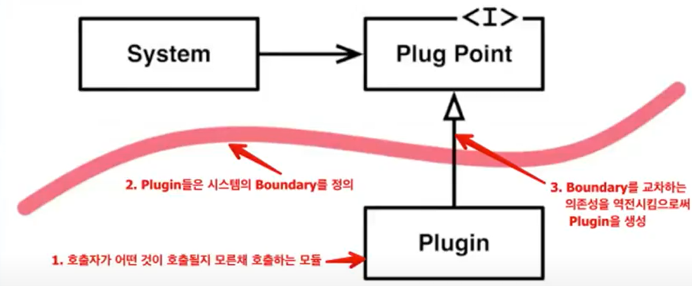

> 백명석 님의 [클린 코더스 강의](https://www.youtube.com/user/codetemplate/videos)를 듣고 요약정리한 글입니다. 문제가 있을 경우 삭제 조치하도록 하겠습니다.

## 1.  Dependency Inversion Principle

<figure>

<figcaption>출처 : 백명석님의 클린 코더스</figcaption>
</figure>

-   High  Level Policy should not depend on Low Level Details
-   둘은 Abstract Type에 의존해야 한다.

## 2. 객체지향의 핵심

-   상속, 캡슐화, 다형성은 객체지향의 핵심이 아닌 수단, 도구, 메커니즘이다.
-   IoC를 통해 상위 레벨의 모듈을 하위레벨의 모듈로부터 보호하는 것이 객체지향의 핵심이다.
-   그리고 객체지향 디자인은 의존성을 관리하는 것이다.
-   DIP를 통해서 하위 레벨의 모듈은 OCP를 준수하면서 새로운 타입이 추가 가능하다. (SOLID는 서로 연관되어 있음)

## 3. Structured Design(구조적 설계)

<figure>

<figcaption>출처 : 백명석님의 클린 코더스</figcaption>
</figure>

구조적 설계를 하면 Top-down 방법론으로 설계를 하게 된다. 하지만, 소스 코드 의존성과 런타임 의존성의 방향이 같다는 문제가 생긴다. 

## 4. Dependency Inversion

<figure>


<figcaption>출처 : 백명석님의 클린 코더스</figcaption>
</figure>

의존성을 역전시키는 절차는 아래와 같다.

1.  A와 B 사이에 polymorphic interface(polymorphic dispatcher, abstract interface)를 삽입
2.  A는 interface를 사용
3.  B는 interface를 구현

## 5. Plugins

<figure>

<figcaption>출처 : 백명석님의 클린 코더스</figcaption>
</figure>

plugin(시스템이 있을 경우, 시스템이 사용하는 변경 가능한 부분들을 말함)

-   Boundary를 Plugin Interface로 다룬다.
-   의존성 역전이 SW 모듈 간의 경계를 만드는 수단이 된다.
-   의존성의 방향은 항상 시스템으로 흘러야 한다.
-   Boundary는 우리가 plugin을 만드는 방법과 같다.
-   Boundary를 만들고자할 때마다 어떤 의존성을 역전시킬지 고민해야 한다.
-   Boundary를 교차하는 의존성의 방향이 같도록 해야 한다.
-   Boundary로 시스템을 나누고 Boundary를 교차하는 의존성을 역전시켜야 한다.

<figure>

<figcaption>출처 : 백명석님의 클린 코더스</figcaption>
</figure>

## 6. Architectural implications

<figure>

<figcaption>출처 : 백명석님의 클린 코더스</figcaption>
</figure>

Usecase(Interactor), DB, WEB을 분리하는 Boundary 간의 의존성을 역전하기 위해 DIP가 사용된다. 왼쪽 controller는 사용자 요청을 해석해서 필요한 정보를 뽑아내 RequestModel을 만든다. (RequestModel이라는 인터페이스를 구현하는 클래스를 생성)

이후에 Boundary를 구현하고 있는 Usecase(Interactor)가 요청을 받아 Repository에서 entity를 가져와 사용한다. 

마지막으로는 ResponseModel을 구현하고 있는 구현체(DS)에 데이터를 채워서 넘겨준다. 이를 controller가 받아서 presenter에게 넘겨도 괜찮고, 혹은 처음 Usecase(Interactor)을 호출할 때 presenter의 레퍼런스를 줘도 괜찮다. 

따라서 ResponseModel을 Usecase(Interactor)가 호출한다는 것은 화면에 그림을 그리는 애를 호출하는 것이다. 웹은 화면을 그리는 애가 html이다. 하지만 Usecase(Interactor)는 html을 호출할 수 없다. 즉, presenter는 화면에 뿌릴 정보를 만드는 역할을 한다. 실제로 화면에 뿌리는 애가 아닌(view), 뿌리기 위한 데이터를 만드는 역할을 한다. 즉, ResponseModel이 변경되지 않는다면, Interfactor를 변경할 필요는 없다. 하지만 데이터를 만드는 로직이 변경되면 presenter만 변경할 수 있다. 

> 중요한 건 의존성의 방향이다.

## 7. 재사용 가능한 프레임워크

-   2인이 1년간 개발한 10만 라인 중 88%의 코드가 재사용 가능한 프레임워크에 있었다.
-   고객은 만족했고, 추후 3개의 애플리케이션을 더 계약한다.
-   하지만 재사용 가능한 프레임워크가 다른 3개의 애플리케이션에 적합하지 않다는 것을 알게 됐다.
-   그래서 재사용 못하고 다시 만든다.
-   고객에게 진실을 말할 수밖에 없었다.
-   7만 7천 라인의 코드가 재사용 가능하지 않다고.
-   하지만 시간과 비용을 고려했을 때 재사용 가능한 코드가 있어야만 했다.
-   그래서 고객은 첫 애플리케이션에서 만든 재사용 가능한 프레임워크를 버리고 바닥부터 만드는 대신 다시 한번 재사용 가능성을 검토하길 원했다.
-   다시 검토
-   이번엔 3개의 애플리케이션을 병렬로 개발했다.
-   다시 7만 7천 라인의 재사용 가능한 프레임워크를 만들었다.
-   3개의 애플리케이션에서 이 프레임워크는 재사용 됐다.
-   이후에는 계속해서 시간과 비용을 줄이면서 개발할 수 있었다.
-   재사용 가능한 프레임워크를 만드는 일은 매우 어렵다.
-   2개 이상의 애플리케이션을 병렬로 개발하지 않는다면 거의 **실패**할 것이다.
-   재사용 가능한 코드는 만드는 노력이 3배, 유지하기 위한 노력이 10배..

## 8. The Inversion

<figure>

<figcaption>출처 : 백명석님의 클린 코더스</figcaption>
</figure>

주목할 점은 Application이 FW에 의존성을 갖는다는 것이다. (프레임워크가 애플리케이션이 가진 것을 호출, doPost, doGet을 생각해 보자.)

-   but, 프레임워크는 Application에 의존성을 가지지 않음
-   FW의 High Level Policy는 Application의 Low Level Detail에 대한 의존성이 없다.
-   일반적인 Structured Design(High Level Module이 Low Level Module에 의존)과는 반대다.

## 9. The Furnace Example

벽에 있는 Thermostat(온도조절장치)을 제어하는 SW를 개발한다고 가정하자.

<figure>

<figcaption>출처 : 백명석님의 클린 코더스</figcaption>
</figure>

-   2개의 input과 2개의 output을 갖는 장치이다.
-   2개의 input: 현재 온도/희망 온도를 읽음
-   2개의 output: heater/cooler를 켜고/끄기 위한 boolean 값을 수신

```java
void regulate() {
    int goal_t, t;
    while(1) {
        sleep(ONE_MINUTE);
        goal_t = in(0x02);
        t = in(0x01);
        if(t < goal_t) {
            out(0x03, true);
            out(0x04, false);
        }
        else if(t > goal_t) {
            out(0x03, false);
            out(0x04, true);
        }
        else {
            out(0x03, false);
            out(0x04, false);
        }
    }
}
```

위 코드는 DIP 위반이다. 왜냐하면 regulate 알고리즘이 low level detail(메모리를 읽고 씀)에 의존하기 때문이다. High level control algorithm은 다른 디바이스와는 사용될 수 없다. 아래는  DIP에 순응하도록 변경한 것이다. HAVC라는 인터페이스를 생성하고, 필요한 함수들을 정의한다.

<figure>

<figcaption>출처 : 백명석님의 클린 코더스</figcaption>
</figure>

OCP의 의도는 확장이 필요한 영역을 abstraction을 하고, DIP의 의도는 low level에 의존하는 것을 abstraction 하는 것에서 차이가 있다.