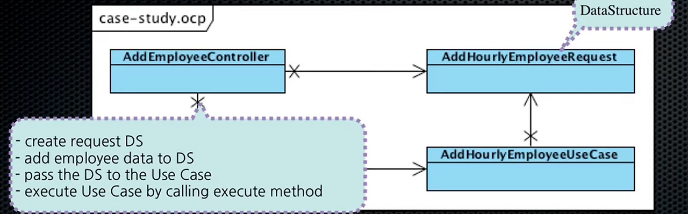
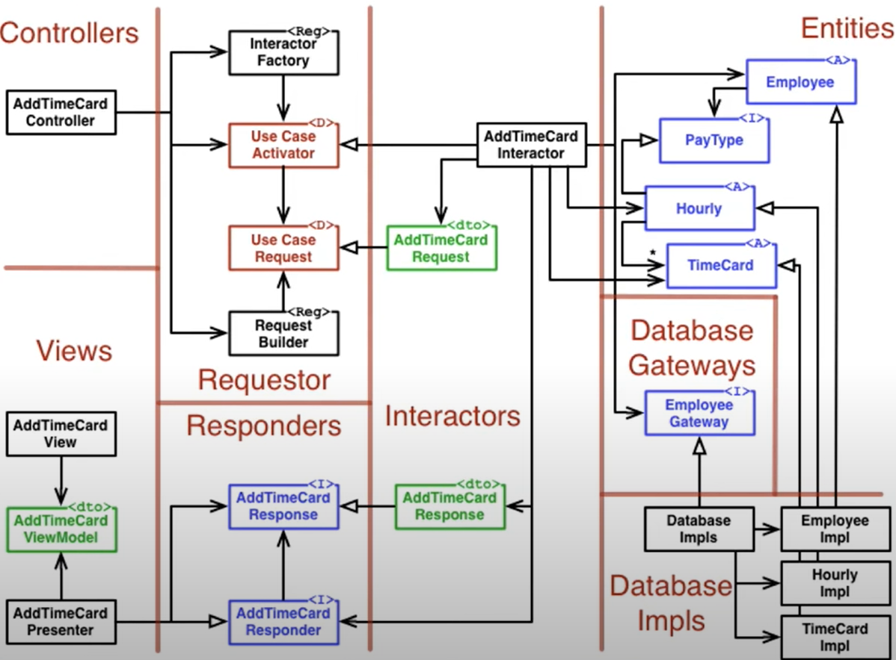

> 백명석 님의 [클린 코더스 강의](https://www.youtube.com/user/codetemplate/videos)를 듣고 요약정리한 글입니다. 문제가 있을 경우 삭제 조치하도록 하겠습니다.

## 1. Requirements and Use Cases

요구사항을 분석하면서 Use Case(주요 기능 모델)와 Entity 목록(정적 데이터 모델)을 작성할 수 있다.

Use Case List

-   AddEmployee
-   DeleteEmployee
-   ChangeEmployee
-   AddTimeCard
-   PayEmployees
-   AddSalesReceipt

아래는 Date Entity(Data Element)의 목록이다. 괄호 안에는 내부 데이터를 표현한다.

-   Employee : CommissionedEmployee(base-pay + commission-rate), HourlyEmployee(hourly-rate)... Salaried..
-   TimeCard(date + hours-worked)
-   SalesReceipt(date + amount-sold)

유스케이스와 데이터 모델은 점진적으로 추가된다. 사원 타입에 따라서 급여 수령 주기가 다르다는 요구 사항이 생기면, 데이터도 변경된다.

-   Cmmissioned-employee = base-pay + commission-rate + BI-**WEEKLY**
-   Hourly-employee = hourly-rate + **WEEKLY**
-   Salaried-employee = salary + **MONTHLY**

또한, 타입에 따라서 지불방법이 달라지게 되면, 더욱 복잡해질 것이다. 여기서 중요한 것은 Use Case가 복잡해지는 것은 데이터가 변경되기 때문이라는 것이다. (오퍼레이션이 변하기 때문이 아님)

조합원에 관한 요구사항이 추가되면 데이터 모델은 다음과 같이 추가된다.

-   employee = pay-type + pay-diposition + union-membership
-   pay-type = {commissioned \| hourly \| salaried}  
    -   commissioned = base-pay + commission-rate + BI-WEEKLY
    -   hourly = hourly-rate + WEEKLY
    -   salaried = salary + MONTHLY
-   pay-disposition = {mail \| PAYMASTER \| direct-deposit}
    -   mail = address
    -   direct-deposit = account
-   **union-membership = {MEMBER | NON-MEMBER}**

## 2. The Single Responsibility Principle

요구사항 분석을 통해 UseCase를 추출하고, 어느 정도 정적 모델링 완료되면 SRP부터 시작한다. 이때 아래 같은 질문을 사용한다.

-   누가 애플리케이션의 액터인가? : Operations, Union, Policy
-   그들의 관심사는 무엇인가?  : 시스템 운영 UI를 이용해 Use Case 사용, 조합원에 관련된 모든 것, 임금을 얼마나, 언제 수령하는가 등

SRP 단계에서는 모듈을 잘 분리하고, 각 모듈이 반드시 하나의 액터만 담당하도록 하는 것이 SRP 단계의 목적이다. 하지만 현실적으로 어렵다.

-   Operations는 모든 UI, 모든 Use Case를 사용한다.
-   여러 액터들과 연관된 데이터가 존재

아래는 AddEmployee라는 Use Case를 세분화시킨 그림이다.


<figure>

<figcaption>출처 : 백명석님의 클린 코더스</figcaption>
</figure>


Operations는 모든 Use Case에 관여하지만, 나중에 UI로부터 Use Case를 분리하면 이 의존성은 사라진다. 하지만, Union과 Policy라는 두 액터가 AddEmployee에 관심을 가지고 있다.(문제) 아래는 액터와 Use Case의 관계다.

<figure>

<figcaption>출처 : 백명석님의 클린 코더스</figcaption>
</figure>


위와 같은 문제를 해결하는 단계는 아래와 같다.

1.  Abstract Use Case(Add Employee)에서 새로운 Use Case(Set Union Membership)를 추출한다.
2.  Add Employee Use Case가 새로운 Use Case를 사용하도록 한다.
3.  Union 액터가 새로운 Use Case를 사용하도록 한다.
4.  Policy 액터는 그대로 Add Employee Use Case를 사용하면 된다.

위 Use Case 다이어그램을 이용해 클래스 다이어그램을 그릴 수 있다. (파란색은 DS, 대칭구조임을 주목)

<figure>

<figcaption>출처 : 백명석님의 클린 코더스</figcaption>
</figure>

### Diagrams and YAGNI(You aren't gonna need it)

-   다이어그램의 작성 이유는 생각하는 프로세스의 상세함을 다른 이들에게 전달하는 것
-   큰 큐모의 프로젝트를 팀원들과 수행한다면, 화이트보드에 그리자
-   다른 사람들이 시스템을 이해하는데 도움이 되려면 지속적으로 갱신할 때만 의미를 가진다. (괴롭다)

### SRP의 의미

-   한 모듈이 하나의 액터를 위한 책임을 갖도록 분리하는 설계를 하는 것이 의미를 가진다. 
-   "나는 늘 액터를 찾고, 이에 기반하여 모듈을 분리한다."

## 3. The Open-Closed Principle

<figure>

<figcaption>출처 : 백명석님의 클린 코더스</figcaption>
</figure>

컨트롤러는 UI에 속한다.

-   DS와 UC의 디테일에 의존성을 갖는다.
-   DS나 UC의 변화가 생기면 컨트롤러도 재배포해야 한다.

이에 대한 해결책으로 DS와 UC에서 컨트롤러를 분리해야 하는데, 이때 빌더, 팩토리, 인터페이스를 사용할 수 있다. (OCP 준수)

<figure>

<figcaption>출처 : 백명석님의 클린 코더스</figcaption>
</figure>

## 4. The Liskov Substitution Principle

<figure>

<figcaption>출처 : 백명석님의 클린 코더스</figcaption>
</figure>

-   AddTimeCardUseCase
    -   EmployeeGateway에서 Employee를 가져온다. (DB에서)
    -   TimeCard를 생성한다.
    -   TImeCard를 HourlyPayType 객체로 Employee에 추가한다.

대충 유추해 보자면, EmployeeGateway.loadById(...).setTimeCard(new TimeCard()) 이런 코드 일 것이다. 근데, 어떻게 PayType이 Hourly인지 알 수 있을까? (다운캐스팅, instanceOf 사용)

실제 코드를 보자.

```java
public class AddTimeCardUseCase implements UseCase {
    public void execute(Request request) {
        AddTimeCardRequest tcReq = (AddTimeCardRequest)request;
        TimeCard timecard = TimeCard(tcReq.date, tcReq,hours);
        Employee e = employeeGateway.findEmployee(tcReq.employeeId);
        e.addTimeCard(timecard);
    }
}
```

-   Employee 클래스는 TimeCard를 알아야 한다.
-   새로운 지불방법이 생길 때마다 Employee 클래스에 addXXX 메서드가 추가되어야 한다. (OCP 위반)
    -   ex) addTossPay, addKaKaoPay..

OCP 문제를 해결하기 위해서는 addTimeCard 메서드를 PayType에 추가할 수 있다.

```java
e.getPayType().addTimeCard(timecard);

public interface PayType {
    public int calculatePay();
    public void addTimeCard(TimeCard tc);
}
```

Hourly만 의미 있는 구현을 제공하고, 나머지는 아무것도 안 하도록 하면 OCP는 해소된다. 하지만, 아무것도 안하도록 오버라이드하면 LSP 위반이다. **(인터페이스에 모든 파생클래스에 적용할 수 없는 메서드를 추가하는 것은 LSP 위반)** 

아래처럼 downcast로 해결 가능한다. LSP 공부할 때, instance of나 down cast 쓰면 안 된다고 했지만, 현재의 경우는 주어진 파생 클래스가 어떤 타입인지 정확히 알기 때문에 down cast로 인한 피해가 없다.

따라서 현재의 경우에는 LSP 준수를 위해 down cast를 하는 것이 괜찮은 방법이다.

```java
public class AddTimeCardUseCase implements UseCase {
    public void execute(Request request) {
        AddTimeCardRequest tcReq = (AddTimeCardRequest) request;
        TimeCard timecard = TimeCard(tcReq.date,  tcReq.hours);
        Employee e = employeeGateway.findEmployee(tcReq.employeeId);
        Hourly hourly = (Hourly)e.getPayType();
        hourly.addTimeCard(timecard);
    }
}
```

## 5. The Interface Segregration Principle

<figure>

<figcaption>출처 : 백명석님의 클린 코더스</figcaption>
</figure>

위 설계는 OCP 준수, ISP 위반이다.

-   RequestBuilder(buildAddHourlyEmployeeRequest.... 등등)
-   UseCaseFactory
-   개발 DS/UseCase 생성을 위한 메서드를 가져야 함

따라서 AddEmployeeController는 너무 많은 것을 알게 된다.(자신이 호출하지 않는 메서드에도 의존을 가짐)

Factory와 Builder에 Fan-in이 점점 많아진다.

<figure>

<figcaption>출처 : 백명석님의 클린 코더스</figcaption>
</figure>

인터페이스의 변경이 생기면 모든 컨트롤러들을 재컴파일/재배포해야 한다. 이를 해결하기 위한 첫 번째 방법은 다이내믹 인터페이스를 사용하는 것이다. 대신 타입 안정성을 잃게 된다. 스프링의 **ApplicationContext.getBean(beanName)**과 유사함. **UseCaseFactory.make(useCaseName)** 요런 식으로 만들 수 있다.

<figure>

<figcaption>출처 : 백명석님의 클린 코더스</figcaption>
</figure>

타입 안정성 이슈를 해소하려면, 특정 컨트롤러가 사용하는 메서드만을 갖는 수많은 인터페이스로 쪼개야 한다. 복잡해 보이지만, 이러한 인터페이스들은 엄청 작고, 적은 수의 메서드만 가지고 있기 때문에 생각보다 이해하기 쉽다.

## 6. The Dependency Inversion Principle

High Level Policy should be independent of low level detail

```java
public class PayEmployee implements UseCase {
    public void execute(Request request) {
        PayEmployeeRequest payReq = (PayEmployeeRequest)request;
        Date date = payReq.date;
        List<Employee> employees = employeeGateway.findAll();
        
        for(Employee e : employees) {
            if(e.getPaySchedule().shouldPay(date)) {
                int pay = e.calculatePay(date);
                pay -= e.getDues(date);
                pay -= e.getTotalCharges(date);
                e.pay(pay);
            }
        }
    }
}
```

밥 아저씨는 위 코드가 DIP가 잘 준수한 아름다운 코드라고 한다.

임금 지불에 대한 알고리즘이 잘 보인다. 구체적인 Employee 유형에 의존하지 않고 아래와 같은 흐름을 적용할 수 있다.

-   임금 지불이 가능한 날인가(if shouldPay)
-   임금 계산(calculatePay)
-   공제(getDues, getTotalCharges)
-   지불(pay)

에피소드 18에 Component Case Study를 보면 아래와 같이 패키지 구조가 잡힌다. (와오)

<figure>

<figcaption>출처 : 백명석님의 클린 코더스</figcaption>
</figure>

<figure>

<figcaption>출처 : 백명석님의 클린 코더스</figcaption>
</figure>

패키지 의존성 상단에 \[X 숫자\]는 파일의 수이다. 낮은 시스템의 결합도, 개별 배포/개발, 개발의 자유도의 관점에서는 더 좋다.