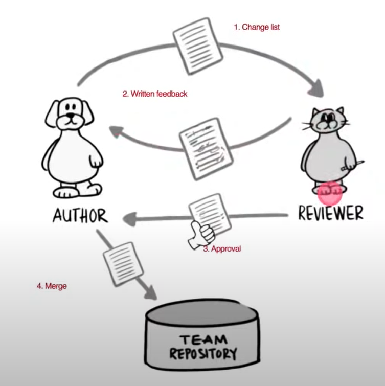

> [백명석님의 우아한테크세미나 - 지속가능한 SW 개발을 위한 코드리뷰](https://www.youtube.com/watch?v=ssDMIcPBqUE&ab_channel=%EC%9A%B0%EC%95%84%ED%95%9CTech)을 보고 정리한 글입니다. 문제가 될 경우 삭제 조치하도록 하겠습니다.

## 1. 왜 코드 리뷰를 해야 하나?

우리가 사는 세상은 불확실하고, 복잡하고, 모호하며 변화가 많은 세상이 될 것이다. 세상이 불확실한 상황에서 비즈니스는 더 빨리 혁신해야 한다. 그에 따라 소프트웨어는 더 빠르고 안정적이고, 빈번히 전달되어야 한다. 이때 장기적으로 소프트웨어의 생산성을 높이기 위해서는 좋은 설계를 유지해야 한다. 개발 생산성과 관련된 특징은 아래와 같다. (설계 체력 가설)

-   설계수익선 아래에서는 일정을 당기기 위해 설계 품질을 희생시키는 것이 의미가 있다.
-   하지만 설계수익선 이후에는 설계 품질 희생이 무의미하다. 

SW 공학의 설계는 완전한 소스 코드이며 빌드는 컴파일을 의미한다. 즉, SW 공학에서 좋은 설계는 클린코드이며,  SW 엔지니어는 설계를 잘해야 한다.(코드를 잘 작성해야 한다.) 시간이 흘러도 생산성 저하, 비용 증가를 막을 수 있는 유일한 방법은 잘하는 것이다. ( Robert C. Martin - "The only way to go fast, is to go well")

코드 리뷰는 개발자가 지금부터 당장 행할 수 있는 공유 활동이다. 그리고 배움을 주고받으며 지속가능한 SW 개발자가 될 수 있는 실천법이다. 코드 리뷰의 주요 목적은 품질 문제 검수(버그, 장애)이다. 뿐만 아니라 아래와 같이 더 존재한다.

-   더 나은 코드 품질 : 아키텍처 속성 개선을 위한 코드 개선(향후 변경 비용 개선)
-   학습 및 지식 전달 : 코드, 해결책 등과 관련된 지식 공유에 기여
-   공유를 통한 성장 : 대개의 경우 리뷰어들도 리뷰 과정에서 지식을 얻게 된다. (하드, 소프트 스킬)
-   동기 부여 : 잘하는 사람들이 하는 걸 보면, 잘하고 싶은 마음이 생긴다.
-   상호 책임감 증대 : 집단 코드 오너십과 결속이 증가한다. 
-   설계 개선 제안 : 좋은 사례를 공유하고, 부족한 부분을 서로에게 물어본다.
-   개발 문화 개선 : 공유활동을 통해 좋은 개발 문화로 발전

## 2. 코드 리뷰의 절차

<figure>

<figcaption>출처 : 우아한테크세미나</figcaption>
</figure>

-   저자(Author) : 코드를 작성하고 리뷰를 요청한다.
-   리뷰어 : 코드를 일고, 머지 가능한지 결정한다.
-   변경 내역(Change List, PR)  : 리뷰 시작 전에 작성하며 저자가 머지를 원하는 소스 코드에 대한 일련의 변경(잘한 것, 아쉬운 것, 눈여겨볼 것)에 대해 기술한다. 

### Tip, 좋은 Pull Request

저자가 고생해서 리뷰어의 시간을 아껴줘야 한다. (11번가의 예시에서는 Description, How to Test, Commits) 로 작성해서 리뷰어의 시간을 아낀다.

## 3. 왜  코드 리뷰가 어려운가

저자는 통상 본인 생각에 멋지다고 생각하는 PR을 보낸다. 반면, 리뷰어는 왜 멋지지 않은지에 대한 장황한 이유를 작성한다. (갈등이 생긴다.) 코드에 대한 비판을 자신에 대한 비판으로 이해하면 코드 리뷰가 어렵다. 코드에 대한 비판은 코드에 대한 것이다. 분리해서 생각하자.

코드 리뷰는 지식 / 공학적 결정을 공유하는 기회이다. 공유를 통해 서로의 지식과 경험을 나누며 상호 학습을 통한 역량 증대 수단이어야 한다. 코드 토의를 개인적 공격으로 받아들이면 물거품이다. 음성 톤이나 표정이 안 보이기 때문에 생각을 글로 전달하는 것은 오해의 위험이 크다. 

## 4. 기법들

### 효율적인 PR 방법

-   지루한 작업은 컴퓨터로 처리 (정적 분석, 중복 찾기, 등을 먼저 컴퓨터로 처리 후 PR)
-   스타일 가이드를 통해 스타일 논쟁을 해소
-   PR을 올릴 때 주석 달기 (리뷰어보다 먼저)
-   모두를 포함하라(많은 사람이 볼 수록 버그를 더 잘 찾아낼 수 있고, 많은 사람이 볼 수록 더 잘하려는 경향이 있다.)
-   의미있는 커밋으로 분리(리뷰가 필요한 거, 필요 없는 거로 분리 가능, 혼자 개발을 해도!)

### 효율적인 리뷰 방법

-   리뷰는 즉시 시작
    -   저자는 리뷰 종료될 때까지 대기함, 리뷰를 바로 시작하면 선순환된다.
    -   코드를 읽고 피드백을 줄 때는 시간을 가지고 진행해도 되지만 시작은 바로 해야 한다. (이상적으로는 수분 내)
    -   리뷰 라운드의 최대 시간은 하루이다. 1일 내 불가하면 다른 리뷰어를 지정하라
    -   월 1회 이상 재지정을 해야한다면 속도를 줄여서 건강한 개발 관습을 유지할 수 있어야 한다.
    -   PR에 포함된 변경이 적도록 노력한다. 반나절 정도 작업한 양 정도(모든 팀원들이 하루에 두 번 작은 양의 PR을 리뷰할 수 있고, 최대 4시간 안에 리뷰가 완료될 것이다.)
    -   Pull Requests는 Latency가 떨어진다. 반면, Pair Programming은 throughput이 떨어진다. 트레이드오프이다. 그리고 팀원의 성향에 따라 다르다. 즉, 답이 없다. (섞어서도 가능)

-   고수준으로 시작, 저수준으로 내려가라
    -   리뷰 라운드에서 많은 의견을 남길 수록 저자가 당황할 위험이 커진다.
    -   초기 라운드에서는 고수준 피드백으로 제한(버그, 장애, 성능, 보안)
    -   고수준의 피드백이 처리된 후에 저수준 이슈를 처리한다.(변수명, 주석을 명확, 설계 개선, 메서드 추출 등)

-   예제 코드 제공에 관대하라
    -   저자를 기분 좋게 하기 위해 리뷰 중에 선물 주기(코드 예제)
    -   너무 긴 예제는 관대한 것이 아니라 억압적으로 보인다.
    -   라운드당 2-3개의 코드 예제로 제한한다. (모든 PR에 예제를 제공하면 저자가 코드를 작성할 수 없다고 생각한다는 신호)

-   리뷰의 범위를 존중하라
    -   PR 근처의 코드를 보고 저자에게 수정을 요청한다. (자주 보이는 Anti-Pattern)
    -   PR에 포함되지 않은 라인은 리뷰 범위가 아닌다. 다만, PR이 둘러싼 코드에 영향을 미칠 때는 예외이다.

-   태그를 활용
    -   \[Nit\] : 고치면 좋지만 아니어도 그만을 의미한다.
    -   리뷰어는 항상 더 개선할 수 있는 의견을 자유롭게 남길 수 있어야 한다.
    -   중요치 않다면 "Nit"를 태그로 남겨서 저자가 무시할 수 있도록 할 수 있다.
    -   교육적인 목적, 지속적으로 기술을 연마하는 것을 돕는 목적
    -   ex) nit : null 대신 Optional을 쓰면 어떨까요 ?, OCP 준수를 위해 Strategy 도입은 어떨까요?

-   한두 등급만 코드 레벨을 올리는 것을 목표로
    -   D 등급의 PR을 받으면 저자가 C나 B 등급을 받도록 도와라
    -   완전하지는 않아도 충분히 좋은 코드가 되도록
    -   그래도 F인 경우가 있다. (기능적으로 틀렸거나, 너무 복잡해서 정합성에 확신이 없는 상태)
    -   수 차례의 리뷰 라운드 후에도 코드가 F 상태인 경우가 승인을 보류하는 유일한 이유이다.

### 피드백 방법

-   절대 "너"라고 하지 마라(너는 왜 맨날..)
    -   리뷰의 핵심은 무엇이 코드를 나아지게 하는 것이다. 누가 그런 아이디어를 냈는지가 아니다. 저자의 방어  유발을 최소화하는 방법으로 피드백해야 한다. (비판의 대상은 저자가 아닌 코드이다.)
    -   ~하는 것을 제안합니다. ~하는 게 어떨까요 등의 오픈커뮤니케이션을 활용하라

-   건설적인 피드백을 하라
    -   코드 리뷰는 경쟁 유발하는 것이 아닌 팀의 생산성을 높이는 것이다.
    -   비판이 아닌 학습의 과정으로 인지하게 해야 한다.
    -   건설적인 피드백은 개발자들이 그들의 실수에서 배우고 역량을 증대하도록 동기부여한다.
    -   건설적인 피드백을 못하겠으면 차라리 아무 말도 하지 마라

-   진정한 칭찬을 해라
    -   대부분의 리뷰어가 잘못된 부분에만 집중한다.
    -   저자가 주니어 혹은 신규 입사자라면 리뷰에 매우 민감하고 방어적일 수 있다.
    -   진심 어린 칭찬은 리뷰어가 도와주려는 팀동료라는 것을 보여 긴장감을 낮춘다.

-   피드백은 명령이 아니라 요청으로 표현
    -   일상에서 동료에게 명령하지 않는다.
    -   Tell, Don't Ask 하라
    -   하지만 리뷰에서는 강압적인 명령이 종종 발견된다.
    -   이 클래스를 별도의 파일로 분리할 수 있을까요? -> 이 클래스는 너무 커지는 것 같은데 괜찮을까요?

-   의견이 아니라 원칙에 기반하여 피드백하라
    -   제안하는 변경과 변경의 이유를 모두 설명하라
    -   이 클래스를 2개로 분리해야 해요 -> 지금 이 클래스는 파일 다운로드와 파싱의 2가지 책임을 가지고 있어요. 다운로더와 파서 2개의 클래스로 분리하여 SRP를 준수하는 것이 어떨까요?
    -   항상 원칙에 기반하여 정확히 뭐가 잘못되었는지 언급할 수 있는 것은 아니다. 단지 그냥 보기 싫거나 직관적이지 않을 수 있다. 이럴 때는 -> 나 전달법(I Message)을 이용한다. ex) 나는 이 코드를 이해하기 어렵네요

-   반복적인 패턴에 대해서 피드백을 제한하라
    -   저자의 실수가 동일한 패턴임을 식별했다면 모든 경우를 언급하지 말라
    -   동일 패턴에 대해 2-3개 정도의 예를 언급하라
    -   개별 사례가 아니라 패턴에 대해서 수정을 요구하라

### 교착상태 시

교착상태로 향하는지 나타내는 신호

-   토론의 톤이 점차 팽팽해지고 공격적으로 됨
-   라운드당 커멘트가 줄어들지 않는 경향을 보임
-   너무 많은 커멘트에 저항이 보임

코드 리뷰의 최악의 결과는 교착상태다. 예를 들어, 커멘트를 반영하지 않으니 승인 거부가 나고, 저자는 커멘트 반영을 거부하게 된다. 이럴 때  만나서 이야기해야 한다. (화상 혹은 만나서 논의)

교착상태를 적극적으로 처리해야 한다.

-   인정하거나 Escalate하라
    -   그냥 승인하라(Agree to disagree)
    -   저수준 코드를 무시모 승인하면 SW 품질이 낮아질 수 있다.
    -   동료와 너무 다퉈서 함께 일하지 않게 된다면 고수준의 품질을 얻을 기회가 사라짐

-   인정이 불가한 경우
    -   저자에게 논의를 팀장이나 테크 리더에게 Escalation
    -   다른 리뷰어에게 할당

-   교착상태로 부터 회복
    -   상황을 관리자와 논의
    -   휴식을 가져라, 가능하다면 안정될 때까지 PR을 서로 보내지 마라
    -   갈등 해결책을 학습

-   설계 리뷰를 고려하라
    -   코드 리뷰 때 설계 리뷰 때 논의되었어야 할 사항을 논쟁하는가?
    -   설계 리뷰는 있었나?

-   아주 심각하지 않다면
    -   그냥 인정하고 좋은 관계로 동료와의 협업을 지속(Agree to disagree)

### 코드 리뷰를 하는 아주 재밌는 방법

-   PR을 작성한 사람과 짝 프로그래밍을 하며 어떻게 고치는 게 좋은 보여주고 Revert 한다.
-   PR을 작성한 사람이 스스로 개선할 수 있도록 기회를 준다.
    -   20분 짝 프로그래밍 개선 / 2시간 스스로 개선
    -   "그래야 스스로 하는 방법을 배우게 됨"
-   결정은 저자가 하는 것이다. 완벽한 설계가 아니라 "당신이 할 수 있는 최고의 설계"를 추구해라
-   팀 정신을 유지하기 위해 불완전한 해결책을 받아들여라
-   모든 설계 결함이 항상 실제로 문제가 되지는 않는다.
-   코드 리뷰의 목적은 비난이 아니라 배움이다.
-   리뷰하는 코드가 걍 나쁠 때는 저자가 그날 무슨 일이 있었을 수도 있다.

## Appendix

### 코드 리뷰 문화 정착의 어려움과 극복 방법 

-   저자의 노력은 중요하다. (리뷰어 n 명의 시간을 절약할 수 있다.) 
-   리더의 관심과 의지도 굉장히 중요하다. (가끔, 그러나 매우 자세히) 
-   코드 비난에 대한 두려움을 없애야 한다.
-   코드 리뷰 문화가 멋져 보여야 한다. (하고 싶어 진다. 그게 뭐든 따라 하고 싶어져야 한다.)
-   어떻게 하면, 당신의 팀이 TDD, Pair Programming, 장인정신등을 받아들일 수 있게 영감을 줄 수 있는가?
    -   좌절할 준비를 해라
    -   당신이 원한다고 남에게 영감을 줄 수는 없다.
    -   당신은 당신 자신의 태도만 제어 가능. 타인이 나의 태도에 어떻게 반응할지는 제어 불가

-   영감은 부산물(side effect)
    -   내가 어떻게 하면 모범이 될 수 있을까?
    -   특정 행동이나 특정 기술을 채택하도록 하려면 모범이 되어야 한다.
    -   기술을 마스터해야 한다. 

-   그러니 모범이 돼라
    -   지각하지 말고, 업무에 기여하고, 긍정적으로 임하고, 사람들을 잘 대하라
    -   기술적 훈련에 대해 언급하려면 고도로 숙달되어야 한다.
    -   키보드로 코딩을 할 때 사람들이 경악을 하도록 해라

-   이렇게 당신이 엄청난 모습을 보여주면 몇몇 사람들에게는 영감을 줄 수도 있을 것이다.

### 코드 리뷰 효과

-   예상하지 못한 버그를 타 프로젝트에서 발견하기도 한다.
-   시간이 지나면 선플이 달리기 시작한다.
-   많은 사람이 내가 작성한 코드를 본다는 생각에 PR 전에 한번 더 코드를 다듬게 된다.
-   좋은 설계, 아키텍처, 클린코드, TDD 등에 대한 공감대/열정 형성

### 코드리뷰를 잘하기 위해 필요한 기술들

-   리팩터링 기술이 중요하다. (마틴 파울러 책)
-   매일 리팩터링
    -   Continuous Renaming
    -   Composed Method(Extract Method)
    -   응집도 높이기
    -   Discover Value Object
-   Working Effectively with Legacy Code
-   TDD
-   Clean Code

### FAQ

-   코드리뷰 자체보단, 공유와 코드에 대한 논의를 할 수 있는 문화가 중요하다.
-   버그 수정 비용은 개발 라이프사이클 후반으로 갈수록 기하급수적으로 커진다는 것을 기억하자.
-   TDD, Test, Refactoring, Code Review 등은 생산성을 증대시킨다.
-   그리고 너무 기법/절차에 의지하지 말라. (온오프를 적절히 섞자) 
-   툴은 중요하지 않고 일단 사람의 눈에 잘 읽히는 코드인지가 중요하다. 주기는 짧게 자주,  PR 사이즈 작게
-   리뷰를 한다고 100% 사전에 잡을 수 없다. SW는 수학이 아니라 과학이다.
-   상사를 설득하기 위해 측정 항목을 정해서 개선 효과를 측정하라(의사결정권자들에게 중요한 것은 이해와 신뢰 구축이다. 그리고 허가가 필요한가?)