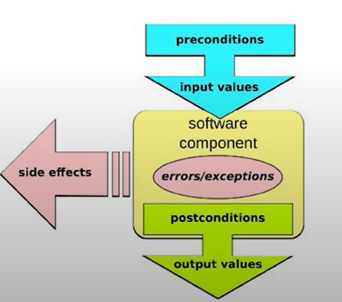
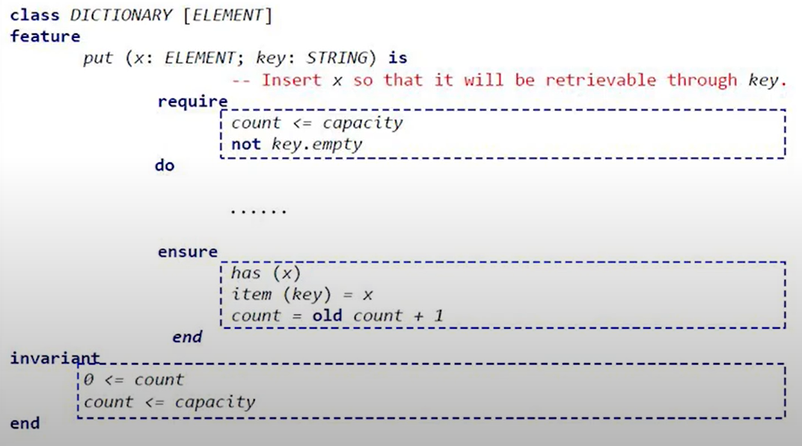

> [스프링 사용자 모임/우아한 형제들 박상철 님의 자바에서 null을 안전하게 다루는 방법을](https://www.youtube.com/watch?v=vX3yY_36Sk4&ab_channel=springcamp.io) 듣고 정리한 글입니다. 문제가 될 경우 삭제 조치 하도록 하겠습니다.

## 1. null에 대해서

> I call it my billion-dollar mistake. It was the invention of the null reference in 1965. - 토니 호어 -

객체지향의 시조가 된 논문인 "레코드 핸들링"에서 특별한 값이 없음을 나타내려고 null을 도입했다. 그리고 이 값을 사용하려고 할 때, 오류를 내도록 설계했다. 그리고, 자바에서 null은 의미가 모호하다. 초기화되지 않았는지, 정의가 되지 않았는

지, 값이 없다는 것인지, null 자체로 값인지 애매하다. 그리고 모든 참조는 기본 상태가 null이다. 사피엔스라는 분석도구로 구글 플레이에 있는 앱들의 소프트웨어 결함을 분석을 했더니, NullPointer의 비율이 높더라

## 2. null을 안전하게 다루는 방법

### 자바 기본 장치 : 단정문(assertion)

```java
assert 식1 ;
assert 식1 : 식2;
```

-   부울식인 식1의 거짓이면 AssertionError가 발생
-   식 2는 AssertionError에 포함된 상세 정보를 만드는 생성식
-   \-enableassertions 또는 -ea 옵션으로 활성화

```java
private void setRefreshInterval(int interval) {
    assert interval > 0 && interval <= 1000 / MAX_REFRESH_RATE : interval;
    ...
}

private void setAge(int age) {
    assert age > 0 : "나이는 양수 : " + age; 
    ...
}
```

단정문을 사용하면 안 되는 경우는 아래와 같다.

-   public 메서드의 파라미터 검사
-   올바른 수행을 위해 필요한 작업을 수행하는 경우

일반적으로 public 메서드에 전달된 파라미터를 검사할 때는 AssertionError 보다 IllergalArgumentException과 같이 알맞은 의미를 갖는 예외를 발생시키는 게 더 좋다. 그리고 Assertion 기능은 vm 옵션에 -ea를 주지 않으면 실행되지 않으므로 주의해야 한다.

### 자바 기본 장치: java.util.Objects

자바 8부터는 null 체크와 관련된 메서드들이 새로 생겼다. 

```java
isNull(Object obj)
nonNull(Object obj)
requireNonNull(T obj)
requireNonNull(T obj, String message)
requireNonNull(T obj, Supplier<String> messageSupplier)
```

자바 9에서는 null 일 경우, 기본값을 제공하는 메서드들이 생겼다.

```java
requireNonNullElse(T obj, T defaultObj)
requireNonNullElseGet(T obj, Supplier<? extends T> supplier)
```

### 자바 기본 장치: java.utill.Optional

Optional - The Mother of All Bikesheds : Stuart Marks

-   절대로 Optional 변수와 반환값에 null을 사용하지 말라
-   Optional에 값이 들어 있다는 걸 확신하지 않는 한 Optional.get()을 쓰지 말라
-   Optional.isPresent()이나 Optional.get() 외 API를 가능한 사용 하라
-   Optional에서 여러 메서드를 연속해서 호출하고 값을 얻기 위해 Optional을 생성하는 건 권장할만하지 않다.
-   Optional로 값을 처리하는 중에 그 안에 중간값을 처리하기 위해 또 다른 Optional이 사용되면 너무 복잡해진다.
-   Optional을 필드, 메서드 매개변수, 집합 자료형에 쓰지 말라
-   집합 자료형(List, Set, Map)을 감싸는 데 Optional을 쓰지 말고 빈 집합을 사용해라.

Optional은 반환값으로만 사용한다. 그리고 Optional은 직렬화가 안된다는 점을 기억하자.

### null 잘 쓰는 법

-   API(매개변수, 반환값)에 null을 최대한 쓰지 말아라
-   사전 조건, 사후 조건을 확인하라. 계약에 의한 설계(design by contract)
-   (상태와 같이) null의 범위를 지역(클래스, 메서드)에 제한하라.
-   초기화를 명확히 하라.

### null 잘 쓰는 법 1: API에 null을 최대한 쓰지 말아라

-   null로 지나치게 유연한 메서드를 만들지 말고 명시적인 메서드를 만들어라
-   null을 반환하지 말라
    -   반환 값이 꼭 있어야 한다면 null을 반환하지 말고 예외를 던져라
    -   빈 반환 값은 빈 컬렉션이나 "Null 객체"를 활용하라
    -   반환 값이 없을 수도 있다면 Optional을 반환하라
-   선택적 매개변수는 null 대신 다형성(메서드 추가 정의; overload)을 사용해서 표현하라

### null 잘 쓰는 법 2: 계약에 의한 설계(Design by Contract)

<figure>


<figcaption>출처 : 스프링 캠프 2019</figcaption>
</figure>

-   API 소비자와 제공자 사이의 지켜져야 할 규약을 지켜야 한다. 
-   형식적 규약 외에 사전 조건(require)과 사후 조건(ensure)과 유지 조건(불변식, invariant)을 포함한다.
-   개방-폐쇄 원칙의 상위 개념이다.

> 개방-폐쇄 원칙이란 소프트웨어 구성 요소(컴포넌트, 클래스, 모듈, 함수)는 확장에 대해서 개방되어야 하지만, 변경에 대해서는 폐쇄되어야 한다는 의미이다. 즉, 변하는 것은 변하기 쉽게, 변하지 않는 것은 변하는 것에 영향을 받지 않게 설계하는 것을 의미... 서버는 인터페이스 규약에 의해서만 확장, 변경한다 따라서  안전된 계약에 의한 설계를 보장할 수 있다.

간단하게 말하면 null이 들어오지 말아야 한다면 잘 확인해야 한다는 뜻이다. 스프링에서 Assert 클래스를 사용하면 도움이 될 것이다.

### null 잘 쓰는 법 3 : null의 범위를 지역(클래스, 메서드)에 제한하라

> OOP to me means only messaging, local retention and protection and hiding of state-process, and extreme late-binding of all things. - Alan Kay

-   기본 문제 해결 원칙 : 큰 문제는 제어 가능한 작은 문제로 나누어 정복하고 다시 통합한다.
-   상태와 비슷하게 null도 지역적으로 제한할 경우 큰 문제가 안된다.
-   클래스와 메서드를 작게 만들어라
-   설계가 잘 된 코드에서는 널의 위험도 약해진다.

### null 잘 쓰는 법 4: 초기화를 명확히 하라

-   초기화 시점과 실행 시점이 겹치지 않아야 한다.
-   실행 시점엔 초기화되지 않은 필드가 없어야 한다.
-   실행 시점에 null인 필드는 초기화되지 않았다는 의미가 아닌 값이 없다는 의미여야 한다.
-   객체 필드의 생명주기는 모두 객체의 생명주기와 같아야 한다.
-   지연 초기화 필드의 경우 팩토리 메서드로 null 처리를 캡슐화하라.

## 3.  null에 안전하다고 보장해 주는 도구

### 자바의 엘비스 연산자(?: ) 논의

자바 문법 개선 프로젝트인 코인에서 최종 탈락했다. 엘비스 연산자를 도입하면 null을 더욱 많이 사용할 것이라 판단했기 때문이다. 또한, 디미터의 법칙을 위반하는 사례가 나오게 된다. 

```java
house?.getfloor()?.getWall(WEST)?.getDoor();
```

대신 Optional을 사용하도록 권유

```java
Optional.ofNullable(house)
    .map(house -> house.getFloor(0))
    .map(floorZero -> floorZero.getWall(WEST))
    .map(wallWest -> wallWest.getDoor())
```

### null 안전성을 도와주는 자바 도구

JSR 305

-   중단된 미완성 표준
-   정적 분선
-   IDE 지원
-   nullaway

JSR 308

-   Checker Framework

### JSR-308 타입 어노테이션

<figure>

<figcaption>출처 : 스프링 캠프 2019</figcaption>
</figure>

-   선언부가 아닌 타입 지정 위치에 어노테이션 추가 가능
-   어노테이션 프로세싱을 통한 빈약한 자바 타입 시스템을 강화
-   초안 제출 2006/10/17, 최종안 승인 2014/2/18 자바 8에 추가
-   CheckerFramework와 동시에 진행

### Checker Framework

-   null 안전성 확인(@Nullable, @NonNull, @PolyNull)
-   Map 키, 잠금, 순차 자료형 색인값, 정규식, 문자열 형식, 단위 등 다수 확인 기능 제공
-   자작 확인 기능 추가 가능
-   특정 환경이나 IDE 독립적

### @NonNull과 @Nullable

```java
public class Address {
    public final @NonNull String address1;
    public final @Nullable String address2;
    
    private Address(@NonNull String address1, @Nullable String address2) {...}
        
}
```

### 기본 null 정책

-   과도한 어노테이션 사용 예방
-   기본 @NonNull (필드, 매개변수, 반환값 등)
-   예외적 @Nullable (지역 변수, 타입 캐스트 등)
-   패키지, 클래스 수준에서 정책 설정(@DefaultQualifier)

### 패키지, 클래스 수준 기본 정책 설정

```java
@DefaultQualifier(value = NonNull.class, locations = TypeUseLocation.LOCAL_VARIABLE)
package dev.fupfin.null_safety.strict;
```

```java
@DefaultQualifier(value = Nullable.class, locations = TypeUseLocation.FIELD)
class MyClass {
	Object nullableField = null;
    @NonNull Object nonNullField = new Object();
}
```

-   @DefaultQualifier
-   패키지(package-info.java)나 클래스 전체의 기본 정책 설정

### 어노테이션 달린 자바 표준 API 제공

-   자바 8 표준 API
-   자바 11 출시 준비 중
-   임의의 API에 어노테이션 설정 가능

### 자동 타입 개선(Automatic type refinement)

-   단순한 정적 타입 확인이 아닌 코드 흐름과 실행 결과를 반영
-   코드를 null 확인을 한 경우 @nonNull로 취급
-   메서드 내부로 제한

### 집합 타입 요소의 null 안정성 지원

-   List, Set, Map, 배열 등 집합 자료형의 요소도 null 확인
-   기본이 @NonNull
-   타입 매개변수에 @Nullable 지정