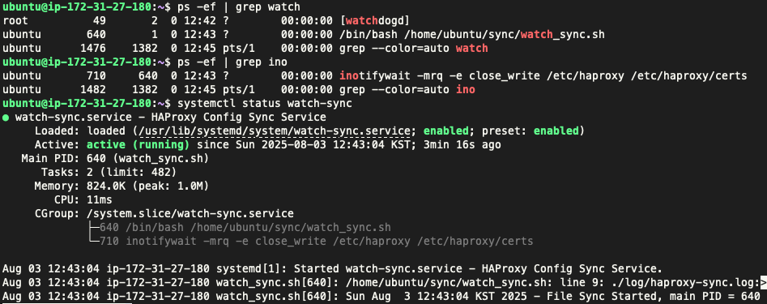
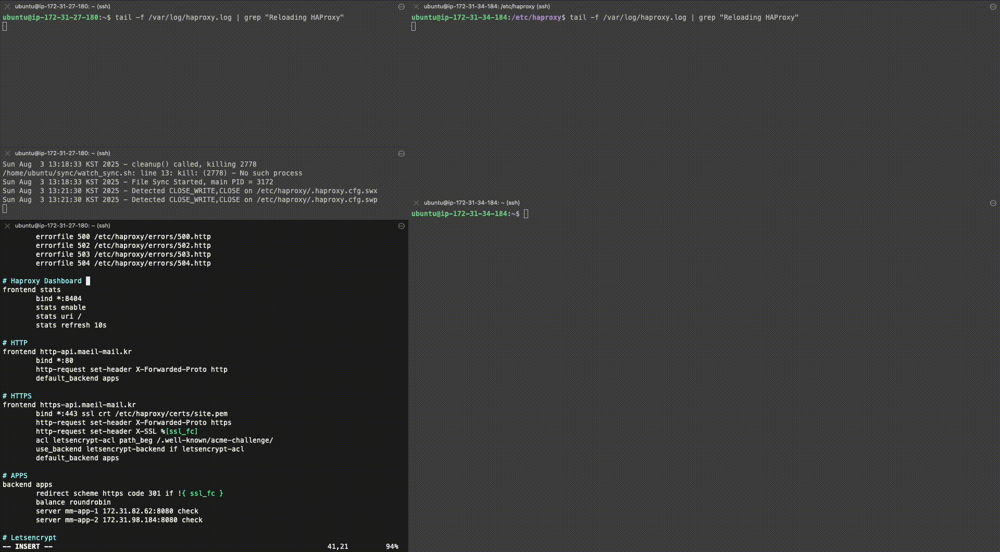
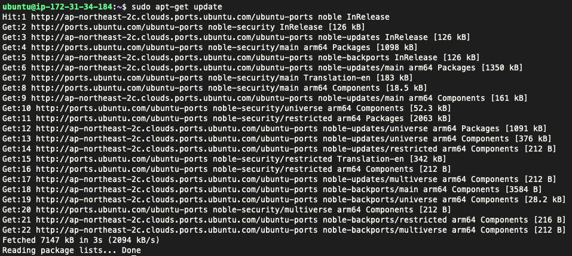
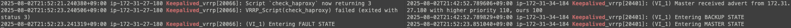
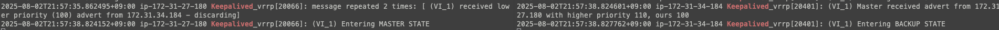
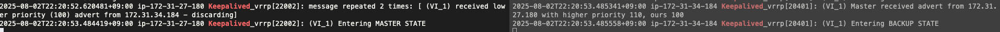
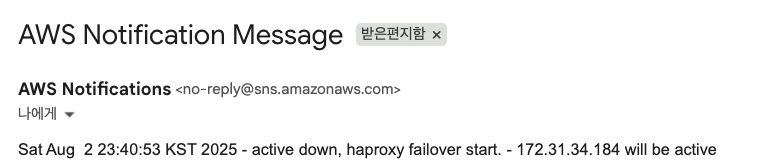

> ALB와 Public Ipv4 비용을 절감하기 위해 Haproxy + Keepalived Active Passive 구성으로 마이그레이션하기로 결정했다.

## 1. 사전 작업

```bash
# 타임존 설정
sudo timedatectl set-timezone Asia/Seoul

# haproxy + keepalived
sudo apt-get update
sudo apt-get install haproxy
sudo apt-get install keepalived

# 인증서 및 설정 동기화 자동화
sudo apt install inotify-tools

# certbot
sudo snap install core
sudo snap refresh core
sudo snap install --classic certbot
sudo ln -s /snap/bin/certbot /usr/bin/certbot

# aws cli
sudo apt-get install unzip
curl "https://awscli.amazonaws.com/awscli-exe-linux-aarch64.zip" -o "awscliv2.zip"
unzip awscliv2.zip
sudo ./aws/install
```

## 2. Haproxy 설정

- 설정 파일 : /etc/haproxy/haproxy.cfg 
- 로그 파일 : /var/log/haproxy.log

```
# Haproxy Dashboard - 관리자 IP 대역만 접근할 수 있도록 SG 설정 필요
frontend stats
        bind *:8404
        stats enable
        stats uri /
        stats refresh 10s

# HTTP
frontend http-api.maeil-mail.kr
        bind *:80
        http-request set-header X-Forwarded-Proto http
        default_backend apps

# HTTPS
frontend https-api.maeil-mail.kr
        bind *:443 ssl crt /etc/haproxy/certs/site.pem
        http-request set-header X-Forwarded-Proto https
        http-request set-header X-SSL %[ssl_fc]
        acl letsencrypt-acl path_beg /.well-known/acme-challenge/
        use_backend letsencrypt-backend if letsencrypt-acl
        default_backend apps

# APPS
backend apps
        redirect scheme https code 301 if !{ ssl_fc }
        balance roundrobin
        server mm-app-1 172.31.82.62:8080 check
        server mm-app-2 172.31.98.184:8080 check

# 인증서 발급 및 갱신 - HTTPS의 ACL letsencrypt-acl 설정 확인
# Letsencrypt
backend letsencrypt-backend
        server letsencrypt 127.0.0.1:9090
```

## 3. Keepalived 구성

- 설정 파일 : /etc/keepalived/keepalived.conf
- 로그 파일 : /var/log/syslog

active 설정

```
global_defs {
    router_id maeilmail-rt-active
    script_user root
}

vrrp_script check_haproxy {
    script "systemctl is-active --quiet haproxy"
    interval 2
    fall 2
    rise 2
}

vrrp_instance VI_1 {
    debug 2
    interface ens5
    state MASTER
    virtual_router_id 50
    advert_int 3
    priority 110
    unicast_src_ip 172.31.27.180

    authentication {
        auth_type PASS
	    auth_pass testpassword
    }

    unicast_peer {
        172.31.34.184
    }

    track_script {
        check_haproxy
    }

    notify_master /etc/keepalived/failover.sh
}
```

passive 설정

```
global_defs {
    router_id maeilmail-rt-passive
    script_user root
}

vrrp_script check_haproxy {
    script "systemctl is-active --quiet haproxy"
    interval 2
    fall 2
    rise 2
}

vrrp_instance VI_1 {
    debug 2
    interface ens5
    state BACKUP
    virtual_router_id 50
    advert_int 3
    priority 100
    unicast_src_ip 172.31.34.184

    authentication {
        auth_type PASS
        auth_pass testpassword
    }

    unicast_peer {
        172.31.27.180
    }

    track_script {
        check_haproxy
    }

    notify_master /etc/keepalived/failover.sh
}
```

failover 스크립트(failover.sh)

```bash
#!/bin/bash

EIP= # EIP
INSTANCE_ID= # 인스턴스 ID

/usr/local/bin/aws ec2 disassociate-address --public-ip $EIP --endpoint-url https://ec2.ap-northeast-2.api.aws --profile lb-user
/usr/local/bin/aws ec2 associate-address --public-ip $EIP --instance-id $INSTANCE_ID --endpoint-url https://ec2.ap-northeast-2.api.aws --profile lb-user
```

- backup 노드에서 해당 스크립트를 실행하려면 인터넷 접근이 필요하다. 하지만, 우리는 EIP가 active 노드에만 존재한다.
- 이 문제를 해결하기 위해서 ipv6를 설정해서 인터넷에 접근했다. (아래에 설정 방법 정리)
- 다만 CLI의 기본 경로는 https://ec2.ap-northeast-2.amazonaws.com/ 로 ipv4만 지원하기 때문에 connection timeout이 발생한다.
- 따라서, 이를 듀얼 스택 경로로 요청하도록 변경해야하는데, 서울 리전을 기준으로 ec2.ap-northeast-2.api.aws에 요청해야한다.

## 4. SSL 설정

인증서 발급, fullchain.pem이랑 privkey.pem을 합쳐서 site.pem으로 만들어야한다.

```bash
sudo certbot certonly \
    --webroot \ 
    --agree-tos 
    -m team.maeilmail@gmail.com \
    -w /var/www/letsencrypt \
    -d test.maeil-mail.kr \ 
    --http-01-port=9090

DOMAIN='test.maeil-mail.kr' sudo -E bash -c 'cat /etc/letsencrypt/live/$DOMAIN/fullchain.pem /etc/letsencrypt/live/$DOMAIN/privkey.pem > /etc/haproxy/certs/site.pem'
```

아래는 certbot renew 타이머 정보를 조회하는 방법이다.

```bash
# certbot renew 타이머 정보 조회
systemctl cat snap.certbot.renew.timer

# 다음 renew 실행 시간 조회
systemctl list-timers | grep certbot
```

renew 할때마다 fullchain.pem이랑 privkey.pem 합쳐야해서 deploy hook 사용해야한다.

/etc/letsencrypt/renewal-hooks/deploy/haproxy-pem-hook.sh

```bash
#!/bin/bash

DOMAIN="test.maeil-mail.kr"
TARGET_PEM="/etc/haproxy/certs/site.pem"
CERT="/etc/letsencrypt/live/$DOMAIN"

cat $CERT/fullchain.pem $CERT/privkey.pem > $TARGET_PEM

echo "$TARGET_PEM generated."
```

스크립트 실행되는지 실행하려면 강제 리뉴얼로 테스트할 수 있다.

```bash
sudo certbot renew --force-renewal
```

## 5. 설정 동기화

/home/ubuntu/sync/watch_sync.sh

```bash
#!/bin/bash
WATCH_DIRS="/etc/haproxy /etc/haproxy/certs"
PIPE="/tmp/haproxy-pipe"
LOG_FILE="/home/ununtu/sync/log/haproxy-sync.log"
REMOTE_USER="ubuntu"
REMOTE_HOST="172.31.34.184"
INOTIFY_PID=0

exec >> $LOG_FILE 2>&1

cleanup() {
  echo "$(date) - cleanup() called, killing $INOTIFY_PID"
  [[ $INOTIFY_PID -gt 0 ]] && kill $INOTIFY_PID
  rm -f "$PIPE"
  exit 0
}
trap cleanup SIGINT SIGTERM EXIT

[[ -p "$PIPE" ]] && rm -f "$PIPE"
mkfifo "$PIPE"

echo "$(date) - File Sync Started, main PID = $$"

inotifywait -mrq -e close_write $WATCH_DIRS > "$PIPE" &
INOTIFY_PID=$!

while read path action file;  do
  echo "$(date) - Detected $action on $path$file"

  if [ "$file" = "haproxy.cfg" ]; then
    scp -p /etc/haproxy/haproxy.cfg $REMOTE_USER@$REMOTE_HOST:/home/ubuntu/tmp/
    ssh $REMOTE_USER@$REMOTE_HOST "sudo mv /home/ubuntu/tmp/haproxy.cfg /etc/haproxy/ && sudo systemctl reload haproxy"
    sudo systemctl reload haproxy
  fi

  if [ "$file" = "site.pem" ]; then
    scp -p /etc/haproxy/certs/site.pem $REMOTE_USER@$REMOTE_HOST:/home/ubuntu/tmp/
    ssh $REMOTE_USER@$REMOTE_HOST "sudo mv /home/ubuntu/tmp/site.pem /etc/haproxy/certs/ && sudo systemctl reload haproxy"
    sudo systemctl reload haproxy
  fi
done < "$PIPE"
```

- active-passive 노드 간 site.pem이랑 haproxy 설정 동기화를 위해서 inotifywait으로 감지한다.
- close_wait만 감지하도록 설정하고, if로 haproxy.cfg랑 site.pem이 변경되면 백업 노드로 전송한다.
    - 이거 하려면, passive 노드에 해당 경로에 대한 디렉터리를 미리 만들어야 하고..
    - active 노드의 public key를 passive 노드 ~/.ssh/authorized_keys에 추가해야한다.
- 스크립트 프로세스에 SIGINT SIGTERM 신호 받으면 트랩으로 inotify 프로세스랑 네임드 파이프를 정리한다. (inotifywait 종료안돼서.. 진짜 골치아팠다..)
- 위에 renewal-hook이랑 마찬가지로 항상 설정을 바꾸면 reload 시켜야한다.
- 입력 리디렉션으로 while에 inotifywait 반환값을 줘야한다.
- 로그는 /home/ubuntu/sync/log/haproxy-sync.log에 출력했다.


이제 해당 스크립트를 자동으로 실행되게 만들려고 한다. systemd에 service로 등록해줄것이다.

/usr/lib/systemd/system/watch-sync.service

```
[Unit]
Description=HAProxy Config Sync Service
After=network-online.target

[Service]
Type=simple
ExecStart=/home/ubuntu/sync/watch_sync.sh
Restart=on-failure
User=ubuntu

[Install]
WantedBy=multi-user.target
```

아래와 같이 입력하고 인스턴스를 재부팅했다.

```sh
sudo systemctl daemon-reload
sudo systemctl start watch-sync
sudo systemctl enable watch-sync
sudo systemctl status watch-sync
```

<figure>

<figcaption> 서비스랑 프로세스 모두 잘 띄워져있다..! </figcaption>
</figure>

마지막으로 동기화 테스트를 해보자.

<figure>

<figcaption> </figcaption>
</figure>


## 6. Failover

앞서 언급했던 것과 같이 AWS CLI를 사용해서 EIP를 할당해야하기 때문에 인터넷 접근이 필요하다.
EIP가 없는 백업 노드는 인터넷 접근이 불가능하다. public ipv4를 사용해서 발생하는 비용을 줄이기 위해 ipv6를 할당해서 페일오버에 필요한 인터넷 접근을 했다.

### ipv6 할당

<figure>

<figcaption> public ipv4 없이도 인터넷이 된다..! </figcaption>
</figure>

- VPC ipv6 CIDR을 설정한다.
- public subnet에 ipv6 CIDR을 설정한다.
- EC2에 ipv6 주소를 할당한다.
- 퍼블릭 서브넷 라우팅 테이블 ::/0 경로에 인터넷 게이트웨이를 추가해줘야한다.
- DNS checker에서 [IPv6 Address Lookup](https://dnschecker.org/ping-ipv6.php) 수행
- 잘안되는 경우, 라우팅 테이블 및 SG에 ipv6 관련 규칙을 살펴보자.
- 클라이언트가 ipv6 주소가 있다면 http://[ipv6 address]로 접속할 수도 있긴한데, 국내 ipv6 보급률은 높지 않기 때문에 해당 경로에 대한 haproxy bind와 SG 규칙은 따로 추가하지 않는다.

### AWS Configuration

- EIP를 할당하기 위한 IAM 사용자를 만든다.
- 고객관리형 정책 하나 만들고 -> "ec2:DisassociateAddress", "ec2:AssociateAddress", "sns:Publish" 쓰기 권한을 추가한다.
- 사용자에게 정책 할당 및 access key 발급
- `aws confiure --profile lb-user` 실행하여 키를 비롯한 설정 정보 입력한다. **(주의 : failover 스크립트를 실행할 리눅스 유저로 접속하여 configure 해야한다.)**

### Failover Test

```sh
sudo systemctl start haproxy
sudo systemctl start keepalived
sudo systemctl enable haproxy
sudo systemctl enable keepalived
```

현재 API 주소에 요청을 보내면 active 노드에서만 요청을 처리한다. keepalived에서 active 노드는 MASTER STAGE가 되고, passive 노드는 BACKUP STAGE로 대기한다. 테스트는 haproxy 다운, keepalived 다운 순서로 진행했다.

**1번 케이스.** active 노드 haproxy 종료되는 경우

<figure>

<figcaption> haproxy 다운 시 failover 수행</figcaption>
</figure>

<figure>

<figcaption> haproxy 재시작 시 기존 active 노드 MASTER 승격</figcaption>
</figure>

**2번 케이스.** active 노드 keepalived 종료되는 경우

<figure>

<figcaption> keepalived 다운 시 failover 수행</figcaption>
</figure>

<figure>

<figcaption> keepalived 재시작 시 기존 active 노드 MASTER 승격</figcaption>
</figure>

### 알림 추가하기

관리자도 모르게 failover 되면 기존 active 노드를 조치하지 못해 passive 마저 다운될 가능성이 있다. 따라서, 알림이 필요하다.
기존 active는 굳이 알림이 필요없다고 판단해서 passive 노드의 failover.sh 스크립트만 아래처럼 수정했다.
사전에 SNS 표준형 토픽을 하나 만들고, 이메일로 구독했다.

```sh
EIP= # EIP
INSTANCE_ID= # 인스턴스 ID
TOPIC_ARN= # 토픽 ARN
FAILOVER_MESSAGE= "$(date) - active down, haproxy failover start. - 172.31.34.184 will be active"

/usr/local/bin/aws ec2 disassociate-address --public-ip $EIP --endpoint-url https://ec2.ap-northeast-2.api.aws --profile lb-user
/usr/local/bin/aws ec2 associate-address --public-ip $EIP --instance-id $INSTANCE_ID --endpoint-url https://ec2.ap-northeast-2.api.aws --profile lb-user
/usr/local/bin/aws sns publish --topic-arn $TOPIC_ARN --message "$FAILOVER_MESSAGE" --endpoint-url https://sns.ap-northeast-2.api.aws --profile lb-user
```

이제 active 노드 인스턴스를 종료 시켜보려고 한다.
<figure>

<figcaption> active 노드 종료 시 failver 수행</figcaption>
</figure>

<figure>

<figcaption> 알림도 잘온다! </figcaption>
</figure>


### 함께 봤던 자료

- [AWS - 활성-대기 상태 서버 간 HA를 위한 플로팅 IP 패턴](https://docs.aws.amazon.com/whitepapers/latest/real-time-communication-on-aws/floating-ip-pattern-for-ha-between-activestandby-stateful-servers.html)
- [AWS - AWS 환경에서 Overlay IP 주소를 활용한 고가용성 구성 및 MCCS 솔루션을 통한 자동 장애조치](https://aws.amazon.com/ko/blogs/tech/aws-overlay-ip-with-mccs/)
- [AWS - CLI 설치 & 등록 방법 - 쉽고 빠르게 설명](https://inpa.tistory.com/entry/AWS-%F0%9F%93%9A-AWS-CLI-%EC%84%A4%EC%B9%98-%EC%82%AC%EC%9A%A9%EB%B2%95-%EC%89%BD%EA%B3%A0-%EB%B9%A0%EB%A5%B4%EA%B2%8C)
- [AWS - CLI Command Reference](https://docs.aws.amazon.com/cli/latest/)
- [AWS - Amazon EC2 서비스 엔드포인트](https://docs.aws.amazon.com/ko_kr/ec2/latest/devguide/ec2-endpoints.html#ipv6)
- [SSL - 듣고있나요 나의 이 모든 패킷을: certbot과 함께하는 HTTPS 적용 (Feat. HAProxy)](https://int-i.github.io/web/2021-10-18/lets-encrypt-certbot-https/)
- [SSL - Let's Encrypt(CertBot) SSL with HAProxy](https://atl.kr/dokuwiki/doku.php/let_s_encrypt_certbot_ssl_with_haproxy)
- [SSL - How do I automatically renew TLS certificates in Haproxy](https://community.99stack.com/d/511-how-do-i-automatically-renew-tls-certificates-in-haproxy)
- [SSL - certbot 퀵스타트](https://certbot.eff.org/instructions?ws=haproxy&os=snap&tab=standard)
- [SSL - Https를 Webroot 방식으로 적용하기(nginx, LetsEncrypt)](https://wonsss.github.io/deploy/https-webroot/)
- [SSL - 배포 및 HTTPS 설정(EC2, Nginx, certbot, dns 방식)](https://wonsss.github.io/deploy/deploy-https/)
- [SSL - How to HTTPS with Hugo LetsEncrypt and HAProxy](https://skarlso.github.io/2017/02/15/how-to-https-with-hugo-letsencrypt-haproxy/)
- [Network - X-Forwarded-Proto (XFP) 이란?](https://linked2ev.github.io/devlog/2019/07/21/WEB-What-is-X-Forwarded-Proto/)
- [OS - 프로세스 종료 신호(SIGINT, SIGTERM) 후킹하기](https://tttsss77.tistory.com/212)
- [OS - inotifywait 명령어 사용하는 방법](https://www.sangchul.kr/979)
- [OS - 고급 Bash 스크립팅 가이드: Bash를 이용한 쉘 스크립팅 완전 가이드](https://wiki.kldp.org/HOWTO/html/Adv-Bash-Scr-HOWTO/subshells.html)
- [haproxy - 공식 문서](https://www.haproxy.com/documentation/)
- [haproxy - haproxy(+keepalived)를 이용한 로드밸런싱 구성](https://engmisankim.tistory.com/56)
- [haproxy - Keepalived and HAProxy in AWS: An Exploratory Guide](https://www.rapid7.com/blog/post/2014/12/03/keepalived-and-haproxy-in-aws-an-exploratory-guide/)
- [haproxy - L4/L7 스위치의 대안, 오픈 소스 로드 밸런서 HAProxy](https://d2.naver.com/helloworld/284659)
- [haproxy - HAProxy 로깅(haproxy logging) 설정하는 방법](https://www.sangchul.kr/104)
- [haproxy - Building a High Availability Cluster with HAProxy, Keepalived, and Docker: A Step-by-Step Guide](https://medium.com/@yahyasghiouri1998/building-a-high-availability-cluster-with-haproxy-keepalived-and-docker-a-step-by-step-guide-9325f4ac8aa7)
- [haproxy - High Available HA Proxy Tutorial With Keepalived](https://grimoire.carcano.ch/blog/high-available-ha-proxy-tutorial-with-keepalived/)
- [haproxy - Nginx vs HAProxy Performance (HTTP/1 - HTTP/2 - HTTPS - Compression)](https://youtu.be/o4gjiBetlZw?si=tRMBbYoAP52G9uvQ)
- [keepalived - Keepalived를 활용하여 간단하게 HA 구성해보기](https://medium.com/naver-cloud-platform/keepalived%EB%A5%BC-%ED%99%9C%EC%9A%A9%ED%95%98%EC%97%AC-%EA%B0%84%EB%8B%A8%ED%95%98%EA%B2%8C-ha-%EA%B5%AC%EC%84%B1%ED%95%B4%EB%B3%B4%EA%B8%B0-73ab791c60fc)
															