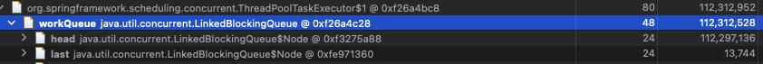

> 다듬는 중

컨텐츠 작성이 중요했던 서비스 초반에 성능을 깊이있게 고려하지 않았기 때문에 많이 불안했다. 불안을 달래고자 성능과 비용에 대해서 [사용자가 늘어난다. 어쩌지..?](https://tech-lovat.vercel.app/mm-traffic/)라는 글을 썼던 적도 있다. 이제는 충분한 컨텐츠가 작성됐기 때문에 시간적인 여유가 생겼다. 뿐만아니라 AWS 프리티어가 8-9월 즈음에 끝나므로 리소스 최적화도 필요다. 그리고.. 때마침 OOM도 터져주셨다 ^_^... 
서버 성능 개선, 리소스 최적화, 메일 발송 개선에 대한 체계적인 계획과 실천을 하는 것이 매일메일의 2-Pause이다.

# 1. 메일 발송 개선

subscribe 전체를 메모리에 적재한 다음 필터링한 이후 메일을 만들고, 각 서버 비동기 스레드 풀 큐에 대략 6,000건씩 요청을 쌓아 고정 처리율을 가진 메일 발송 배치를 구현했다.
서비스 초반에도 이 부분이 불안했기 때문에 주기적으로 메모리 메트릭을 봤었고, 256MB로도 충분히 안정적으로 보낼 수 있다고 판단했다. 
그 근거는 GC 이후 힙 메모리 여유 공간을 확보하는 모습을 계속 관찰했기 때문이다. 하지만, **부실한 근거로 얻은 안정감에 취해서 구독자가 증가할수록 점점 올라가는 오전 7시 Heap Used 수치를 미리 알지 못했다.**

**인지와 대응**은 다음과 같이 했다.

- 관리자용 메일 전송 결과에 누락 메일 약 1,000건 확인
- 서버 로그 확인
- 다수의 Heap Space OOM 식별
- API는 동작하지만 메트릭 관련 스레드가 종료되어 메트릭 확인 불가 = 사건 발생 이후 메트릭 수집 중단됨
- (초기 대응) JVM 메모리 사이즈 512MB로 변경

**원인 식별**은 다음과 같이 했다. 
- 실제 운영 환경에서 메일 발송을 수행할 수 없기 때문에 로컬 Docker Compose 환경 구축하고 메모리 및 cpu 제한
- 운영 DB 데이터를 로컬 Docker DB에 적재
- 로컬 Docker Compose 테스트 환경을 Datadog에 연결
- OOM 발생 시 힙덤프 파일을 생성하는 플래그를 추가하고 테스트를 진행했으나 OOM 발생안함(-XX:+HeapDumpOnOutOfMemoryError)
- 발송 도중에 jmap으로 힙덤프 파일 획득하는 방향으로 진행 -> 덤프 파일 획득
    - 하는 과정에 삽질했던 부분 -> Docker 베이스 이미지를 distroless를 사용했는데, distroless는 초경량이라 jmap이 없었음
    - 다른 임시 Java 컨테이너를 생성 -> PID 네임스페이스 공유를 통해서 임시 Java 컨테이너의 jmap으로 distroless 컨테이너의 힙덤프 파일 생성
- 이클립스 MAT으로 가장 많이 사용되는 객체 식별
    - dominator_tree에서 Retained Heap[[1]](#retained_heap) 순으로 정렬
    - 비동기 스레드풀 큐가 메모리를 가장 많이 사용함

<figure>

<figcaption>OOM이 발생하지 않는 테스트였단 점을 기억해야한다. 이는 subscribe 전체를 메모리에 올리는 것도 문제가 될 수 있지만 이번 테스트에서는 다루지 않았음을 의미한다. </figcaption>
</figure>

결국 이 사건의 원인은 **메일을 일괄 전송하기 위해 한번에 많은 데이터를 적재하고 처리하기 때문에 OOM이 발생한 것으로 결론**지었으며, 메모리를 무한 증설하기는 어렵기 때문에 분할 처리를 하기로 결정했다.
메일 전송을 위해서 메일 컨텐츠를 조회하고 전송 대상자인지 검증하고.. 메일을 전송한 이후 성공과 실패 내역을 저장하는 일련의 로직이 있고, 처리율과 동시 처리 제어, 재전송 처리와 같은 로직이 있다. 
이러한 로직들을 꾸준히 유지보수하는데 어려움이 있다고 판단하여, 분할 처리, 배치와 관련된 부가 기능, 기능 확장성을 확보할 수 있는 스프링 배치 프레임워크로 마이그레이션하려고 한다.

# 2. 리소스 최적화에 대한 개략적인 목표

가용성 및 확장성을 확보하면서도 리소스를 최적화하는 것이 개략적인 목표다.
아직 제대로 정해진 바는 없는데 **ECS + 컨테이너 기반 인프라**를 고려하고 있다.
상시 유지 API 컨테이너는 한대. 스케줄을 통해 스프링 배치 프로세스를 필요할때만 띄우는 방향성을 생각하고 있다. (ECS 스팟 인스턴스 및 람다를 고려)

# 3. 서버 성능 개선 목표

서버 성능을 아무 기준도 없이 향상시키는 것은 원치않다. 예를 들어, **Redis 도입 -> 빨라짐!** 과 같은 기준 없는 성능 향상은 
(학습의 관점에서는 도움이 되겠지만) 서비스 관점에서는 크게 도움이 되었음을 증명하기 어렵기도 하며, 합리적인 성능 목표가 없기 때문에 불필요한 리소스를 사용할 가능성을 만든다.
그래서.. 성능 개선을 하기 위한 기준을 만들기로 결정했다.  

이번 글에서는 정확한 목표를 수립하기보다는 목표를 수립하기 위한 절차를 계획하는 것을 다룰 것이다. 그 이유는 더욱 구체적으로 목표를 수립하기 위한 기준 데이터를 수집할 기간이 필요하기 때문이다.

## 1단계. 개략적인 서비스 규모

- **목표 서비스 규모** : 최대 30,000명의 구독자를 수용하는 시스템을 만든다.
    - 현재 서비스 규모는 구독자 11,000명, MAU는 12,000, DAU 1,000, Edge Request 대략 4,000건 (7시부터 12시간 동안)
    - 향후 2년뒤에도 안정적으로 운영되는 서비스를 만들고 싶다. (주니어 초반 바쁜점을 반영)
    - 마케팅을 고려하지 않고 단순 구독자 증가 추이를 근거로 하는 경우, 월 평균 500명의 신규 사용자가 유입되므로 2년 이후에는 23,000명
    - 분야별 질문 사이클이 6개월이라는 것을 고려, 6개월 단위로 마케팅 유입을 허용한다는 가정하에 30,000명 달성 가능성이 존재한다고 판단
    - 뿐만아니라 예기치 못한 이벤트(유명인의 홍보)로 사용자가 급증하는 상황이 발생할때 20,000명을 목표로하는 것보다 30,000명을 목표로하는 것이 여유롭다고 판단
    - 낙관적 전망으로 30,000명이지만.. 15,000명도 달성하지 못하고.. 구독자가 점차 감소하는 추세도 나타날 수 있다. 
    - 이럴 경우에 대해 확신이 있으면 비관적 전망을 채택하는게 개선 비용 관점에서 효율적이지만, 알 수 없는 영역의 일이라 판단하여 우선 낙관적 전망을 택한다. 
    
- **고민** : API 서버를 오토 스케일 그룹에 추가, 상시에는 서버 1대로 15,000명을 수용하다 최대 30,000명까지 수용하는 시스템으로 자동 확장하는 방향성
    - (궁금한 점) 평시에는 서버 1대로 150TPS 유지 -> 기준에 비해서 고부하인 경우 서버 1대 증설(300TPS)하는 방향을 택할지? 혹은 서버 1대로 300TPS 유지할지? 고민된다.
    - 일단, 1대 기준 30,000명을 수용하도록 최대한 개선해보고! 목표 달성을 위한 개선 비용 확인하고.. 어떻게 할지 결정해보자. (이 부분이 애매하네)

## 2단계. 서비스 운영 예산 결정

> 여기서부터는 2번 글인 리소스 최적화의 이유로 봐도 될거 같다. 글을 쓰다가 궁금한게.. 수익 모델이 있으면, 예산을 결정하고 이를 바탕으로 예상 서비스 규모를 결정하는가?가 궁금하다. 우리 서비스는 정해진 예산은 없고, 사용자 규모와 전망만 있어서 서비스 규모 먼저 설정했다.

- 지금 현재 AWS에서 지원받은 크레딧이 812달러 남은 상태이며, 예산을 넉넉하게 잡아도 (대략 1년) 이후부터 운영자들의 돈이 나간다.
- 일단 (대략 1년)을 최대한 늦추는 것이 첫번째 목표다.
    - 7월 지불 예정 : 48
    - 8월부터 764 / 12 = 최대 63달러 ~ 더 낮으면 너무 좋음!
    - (구독자가 3배가 되면 월 평균 90만개 메일을 발송하는데 이 비용만 대략 70달러인데 그때는 어쩌지?.. ㅎㅎ;; -> 메일 전송에서 알림이나... 카톡이나...다른 수단으로 핵심만 유지하는 방식으로 개선..? 혹은 휴면 계정 도입을..)
- 수익 모델이 있으면 좋겠지만, 수익 모델이 없으므로 정확한 예산 산정이 불가하다. 그저.. 최대한 적을수록 좋다.
- **(중요)** 이러한 경우에는 초반에는 목표를 설정하고 -> 성능 개선한 이후 -> 더욱 빈번히 비용 최적화를 수행하여 -> 비용을 핏하게 사용하는 서비스로 만드는 것이 이상적이지 않을까 싶다. + 수익 모델을 추가하거나?
- 만약에 최적화된 비용조차 감당하기 어려울 정도로 팀원들의 동기가 없는 경우에는 Oracle Cloud Infrastructure로 마이그레이션하는 것도 진지하게 고민하고 있다.

## 3단계. 전체 시스템 성능 목표 수립

> 여기서부터는 조대협님의 [성능 엔지니어링 대한 접근 방법 (Performance tuning)](https://bcho.tistory.com/787)이라는 글에서 큰 영감을 받았다. 그리고, 구체적인 수치는 목표를 수립하기 위한 예시로 보면 된다.
          
로드밸런서 활성 커넥션 지표 중 가장 높은 25 connection/s를 근거로 **최대 동시 접속자는 75명(25명 * 3)**로 산정했다.
팀 내부 합의를 통해서 **시스템 목표 평균 응답 시간(network time + transaction time의 평균 = 평균 응답 시간)은 200ms**로 가정한다. 
여기서 말하는 시스템 목표 평균 응답 시간은 여러 사용자가 동시 다발적으로 중요 시나리오에 해당되는 API를 호출했을 때, 평균적으로 발생하는 응답 시간을 의미한다.  

> 활성 커넥션 지표 25는 저녁 시간대에 측정한거다. 서비스 트래픽 패턴을 고려해 가장 사용자가 많은 오전 7시부터 오전 10시 사이의 최대 활성 커넥션의 수를 식별해야한다고 생각한다. (이상하게 클라우드와치는 초단위 쿼리는 최근 3시간까지만 되는 것 같다..)

시스템 목표 평균 응답 시간을 결정하기가 어려워 아직 정하지 못했다. 일단 이 글에서 200ms를 가정한 이유는 서칭 과정에서 특정 개발팀에서 200ms를 목표로 설정했다는 글을 봤기 때문이다.  

[성능 튜닝 전에 성능 예산부터 구하자](https://velog.io/@sontulip/web-performance-budget) 글의 사례에서는 중요 페이지를 선정하고 **LCP(Largest Contentful Paint)**, **TTI(Time To Interactive)**, **FCP(First Contentful Paint)**, 그리고 몇가지 규칙과 가정으로 시간 예산을 분배하는 방식을 사용했다. 개인적으로 이 글이 너무 마음에 들었는데, 사용자 관점에서 생각하려는 노력이 보였기 때문이다. 특히, "사용자는 20% 이하의 성능 차이는 인지하지 못한다."라는 가정을 토대로 서비스 경쟁력을 위해 타서비스에 비해 20% 이상 뛰어난 서비스를 만들겠다는 논리가 인상깊었다.  

돌고 돌아서.. 결론은 전체 시스템 성능 목표는 **"75명의 동시 사용자를 기준으로 동시 다발적으로 시스템에 요청을 보내도 200ms 이내로 응답을 해야한다."** 가 되고, **전체 시스템 처리량은 375TPS**를 목표로 한다는 것이다. (아래식 참고)

$$ 
\begin{align*}
TPS = \frac{\text{Active User}}{\text{Average Response Time}}
\end{align*}
$$

## 4단계. 개별 기능 성능 목표 수립

예를 들어, 시스템에 다음과 같은 기능이 있다고 했을 때

- 질문에 대한 답변 조회
- 받은 질문 목록 조회
- 구독

각각의 평균 호출 횟수는 다음과 같다고 가정하겠다.

- 질문에 대한 답변 조회 : 2회
- 받은 질문 목록 조회 : 1회
- 구독 : 1회

전체 기능 호출 횟수가 4건일때 질문 보기 상세는 2, 리스트 조회는 1, 구독은 1회다. 이때, 사용자 규모가 3배 늘어난다면 기능 호출 횟수는 다음과 같다. 질문 보기 상세가 변동이 없는 이유는 해당 기능의 응답은 Next.js에서 캐싱이 수행되기 때문에 사용자 규모 증가에 영향을 받지 않기 때문이다. 

- 질문 보기 상세 : 2회(캐싱됨)
- 받은 질문 목록 조회 : 3회
- 구독 : 3회

여기서 짚고 가야할 부분이 하나 있다. 받은 질문 목록 조회의 성능을 개선하기 위해서 로드 밸런서 뒷단에 캐시 계층을 추가했다. 그러면, 구독자 6만명이 될때 호출 횟수를 증가시켜야하는가?에 대해서 잠깐 고민했는데 기본적으로 동시 사용자를 로드 밸런서에 대한 활성 커넥션 수로 정의했기 때문에 증가시켜야 한다고 생각한다. 그렇지 않으면, 다른 기능이 실제와 다르게 호출 비율이 높게 계산될 것이기 때문이다.  

기능 호출 비율은 25 : 37.5 : 37.5가 된다. 이 비율을 전체 시스템 TPS에 적용하면 아래와 같이 개별 기능 성능 목표를 알 수 있다.

- 질문 보기 상세 : 93.75TPS(375 * 0.25) 
- 받은 질문 목록 조회 : 140.6 TPS(375 * 0.375)
- 구독 : 140.6TPS(375 * 0.375)

동시 호출 사용자의 경우에는 다음과 같다. 75명에 기능 호출 비율을 곱하거나, 아래와 같이 TPS에 응답 시간을 곱해도 된다.

$$ 
\begin{align*}
\text{Active User} = {\text{TPS}} * {\text{Average Response Time}}
\end{align*}
$$

- 질문 보기 상세 : 18.7명(93.72 * 0.2)
- 받은 질문 목록 조회 : 28.12명(140.6 * 0.2)
- 구독 : 28.12명(140.6 * 0.2)

## 5단계. 테스팅 - 개선 - 목표 변경

성능 테스트를 진행한 이후, 목표에 도달하지 못한다면 성능 개선을 진행한다. 만약에 진행하는 과정에서 현실적으로 개선이 어렵다고 판단하는 경우에는 목표를 조정한다.

### 메모

<small id="retained_heap">[[1]](#retained_heap) Retained Heap이란 해당 객체와 연결된 모든 객체를 포함한 메모리 사용량을 의미한다.</small>
